# Продвинутый практикум: мультиагентная разработка на Python

**Уровень:** для разработчика с практическим Python, Git и pytest. Опыт с Ollama, LangGraph, MCP и агентными фреймворками не требуется — они появляются в контексте инженерных задач.
**Ритм:** 8 недель, ориентир 3–5 часов в неделю на обязательное ядро.
**Основной результат:** минимальный проверяемый Python-workflow для безопасного решения задачи в кодовой базе.
**Инструменты:** Python, pytest и Git. Живой прогон требует model API через небольшой адаптер: локальный Ollama или уже доступный API-провайдер. Подписка Kilo/Kodacode даёт удобную ручную проверку в IDE, но не API-доступ для Python-клиента. Тесты пишутся с mock provider — заглушкой, которая отвечает заранее заданными ответами вместо настоящего API, поэтому платный API не обязателен.

## Зачем этот курс

Курс учит не основам программирования и не первым промптам, а построению проверяемого агентного процесса. Нужны практические навыки Python, Git, pytest или аналогичного тестового runner-а, понимание HTTP/JSON и базовая работа с терминалом.

Всё дальнейшее строится вокруг небольшого Python-репозитория: договорённости между этапами, ограничение действий, оценка качества и безопасная работа с изменениями. Если пакет или инструмент установить не проблема, но автономные агенты пока не строились — это подходящий уровень.

### Что является обязательным ядром

- **Baseline (базовая версия)** — самый простой вариант, который уже работает: один агент, один промпт, без ролей и контрактов. Один baseline coding agent (LLM-агент, который читает и меняет код по одному промпту) и один минимальный multi-agent workflow сравниваются на одних и тех же задачах: без baseline нельзя доказать, что добавленные роли что-то улучшили.
- Capstone реализует только необходимую цепочку: `planner → read-only analyst → proposed patch → human approval → tests → reviewer/report`.
- Для моделей используется один model provider — компания, чей API вызываете (OpenAI, Anthropic, Ollama или другая). Переключение моделей, локальная интеграция, LangGraph и MCP — расширения, а не входные условия.
- Политики и проверки сначала реализуются простым Python-кодом; фреймворк подключается только при конкретной необходимости.

В занятиях встречаются метки **Обязательное ядро** и **Расширение**. Выполнение расширений не требуется для зачёта основного курса.

## Формат практикумов и локальная модель

Формат практикума взят из [материалов Zerocoder](sources.md): много практики с быстрым результатом и разделение работы между ролями. К этому добавлено то, что нужно разработчику, — критерии качества, проверяемые договорённости между этапами, ограничение инструментов, git-границы и тесты.

Настройка Ollama, выбор локальной модели и диагностика VS Code/Kilo вынесены в [страницу о выборе модели](local-models.md) и [справочник подключения](ollama-vscode.md). Это справочный материал: основной курс можно проходить на уже настроенном провайдере.

## Центральная модель курса: агент — это система вокруг LLM

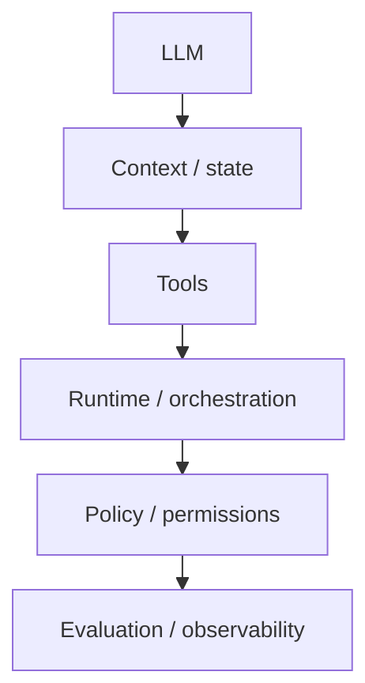

**LLM** (Large Language Model, большая языковая модель) умеет только одно: по тексту предсказывает следующий фрагмент ответа. Модель может подсказать правку в коде, но не может ни прочитать файл, ни запустить тест, ни узнать, что правка сломала соседний модуль. Поэтому модель сама по себе ещё не система-агент: агент возникает только внутри обвязки, которая подаёт контекст и состояние, вызывает инструменты, управляет переходами, применяет права и проверяет результат. Надёжность определяется этой системой, а не одной моделью или удачным промптом.

Ниже каждый слой появляется из конкретной потребности — сначала называем проблему, потом вводим слой:

| Слой | Какую проблему решает |
|---|---|
| LLM | предлагает следующий шаг и текст ответа |
| Context / state (состояние) | что модель видит сейчас и что уже известно о прогрессе |
| Tools (инструменты) | как модель читает файлы, ищет по репозиторию и запускает разрешённые команды |
| Runtime / orchestration | кто вызывает следующий шаг и при каком условии |
| Policy / permissions | какие действия разрешены и какие требуют подтверждения |
| Evaluation / observability | как понять, что результат правильный, а переход — неслучайный |

Провайдеры и фреймворки (OpenAI/Anthropic, LangGraph, Ollama, IDE-агенты, MCP) — конкретные реализации этих идей, а не отдельная тема. **Tools change. Architecture remains.** Владение фреймворком само по себе не означает владения agent engineering.

Слои объясняются в том порядке, в котором вы их реализуете: state, context и tools — недели 3 и 6, policy и permissions — неделя 6, evaluation и tracing — неделя 7.

## Что даёт каждая неделя

| Неделя | Тема | Артефакт недели |
|---|---|---|
| 1 | Где мультиагентность реально нужна | baseline и один workflow-кандидат на 3–5 issue |
| 2 | Топологии и handoff-контракт | граф capstone с явными условиями перехода |
| 3 | Контекст и специализация ролей | типизированные шаблоны planner / analyst / reviewer |
| 4 | Подключение model provider | smoke test выбранного провайдера |
| 5 | Provider-agnostic оркестратор | Python-workflow с state, бюджетом вызовов и тестами на mock |
| 6 | Tools, разрешения и policy | проверки allowlist, approval и отказов |
| 7 | Оценка качества и трассировка | trace успешного и неуспешного запуска, отчёт baseline vs workflow |
| 8 | Capstone | `problem-definition.md` и вертикальный срез workflow |

Продолжение основного курса — [трек автономных агентов](autonomous-agents.md): ещё шесть модулей, из которых выбирают 1–2 под свою задачу.

---

## Архитектура курса

### Учебный репозиторий

Не используйте вначале production-репозиторий. Возьмите подготовленный [учебный репозиторий курса](lab-repository.md) или создайте disposable Python-проект по спецификации ниже.

```text
src/
tests/
docs/
issues/
```

Подготовьте 5 основных issue с критериями приёмки и известным ожидаемым поведением:

- bug с воспроизводящим тестом;
- «добавить тест» без изменения production-кода;
- документационная правка с ограниченным scope — то есть с явно перечисленными файлами, которые разрешено менять;
- неоднозначный запрос, где правильный результат — `needs_input`;
- небольшое изменение с регрессионным edge case.

**Расширение:** добавьте red-team issue с prompt injection: инструкция внутри данных, которую агент принимает за команду. Доведите набор до 10 кейсов.
{: .course-note .course-note--extension }

Для сравнения прогоняйте одни и те же issue в baseline и workflow. Не подмешивайте секреты и личные данные. Если готового starter repository нет, этот список — минимальная спецификация для его подготовки, а не отдельная задача по разработке полноценного учебного продукта.

### Основной capstone

**Проверяемый workflow для безопасного решения Python issue**:

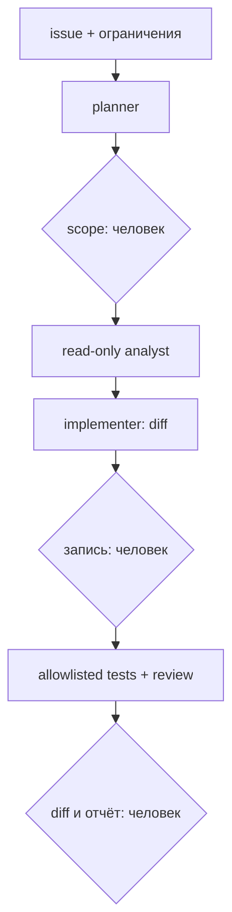

Разделять analyst на repo analyst и test analyst нужно только если эксперимент показывает пользу. Не поручайте агенту самостоятельно мержить или публиковать изменения. Исполнение shell-команд — ограниченная возможность с явными разрешениями и аудитом. Для первого прототипа агент предлагает команды, а разработчик запускает их сам.

### Роли

Роли ниже — каталог возможных обязанностей, а не требование реализовать шесть отдельных агентов. Добавляйте роль только когда она закрывает свою задачу и её польза измерима. В обязательном ядре чтение репозитория и анализ тестов можно объединить в одну read-only роль.

| Роль | Какую проблему закрывает | Что возвращает |
|---|---|---|
| Triage/Planner | issue написан для человека, а модели нужен проверяемый контракт | критерии приёмки, неизвестные, допустимый scope |
| Read-only Analyst | агент не видит репозиторий и выдумывает устройство кода | ссылки `path:line` и подтверждающие фрагменты, ничего не пишет |
| Implementer | нужен минимальный diff, а не переписывание | diff внутри утверждённого scope |
| Test Runner | «работает» без проверки — это не результат | команда, stdout/stderr и exit code |
| Reviewer | автор проверяет себя хуже, чем отдельная проверка по критериям | замечания с severity и доказательством |
| Orchestrator (оркестратор) | без него переходы между ролями зависят от того, как модель сформулирует текст | проверенные контракты, состояние и условие перехода |

**Расширение:** выделить Test Analyst и независимого Reviewer в отдельные model calls, только если измеримо улучшается результат.
{: .course-note .course-note--extension }

Это логические роли, а не обязательные отдельные модели или процессы. Параллелить стоит только действительно независимые чтения, если это оправдано выбранным провайдером и средой.

---

## Неделя 1. Переносим coding-agent практику в проверяемый процесс

<div class="week-brief">
<dl>
<dt>Что уже умеем</dt>
<dd>Python, Git, pytest, вызов модели по одному промпту.</dd>
<dt>Какую проблему решаем</dt>
<dd>По готовому ответу не видно, где агент ошибся, и не с чем сравнивать.</dd>
<dt>Что нового появится</dt>
<dd>Роль / агентный runtime / оркестрация и первый baseline.</dd>
<dt>Что получится в конце</dt>
<dd>Baseline и workflow-кандидат на 3–5 issue с критериями.</dd>
</dl>
</div>

### Материал

Сначала посмотрите на разницу, а потом на термины. **Workflow** — заранее написанная последовательность шагов, которую выполняет код. **Агент** решает ту же задачу иначе: следующий шаг он выбирает сам во время работы и может вернуться назад:

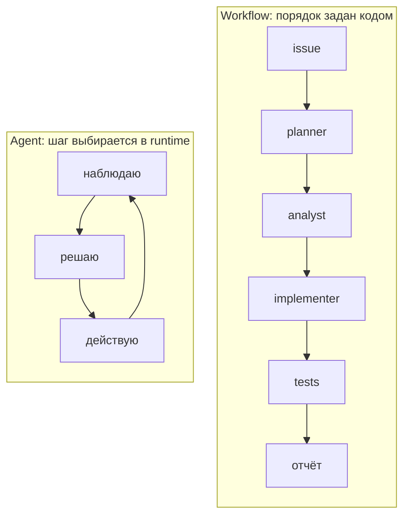

Два похожих на первый взгляд варианта делят код на роли:

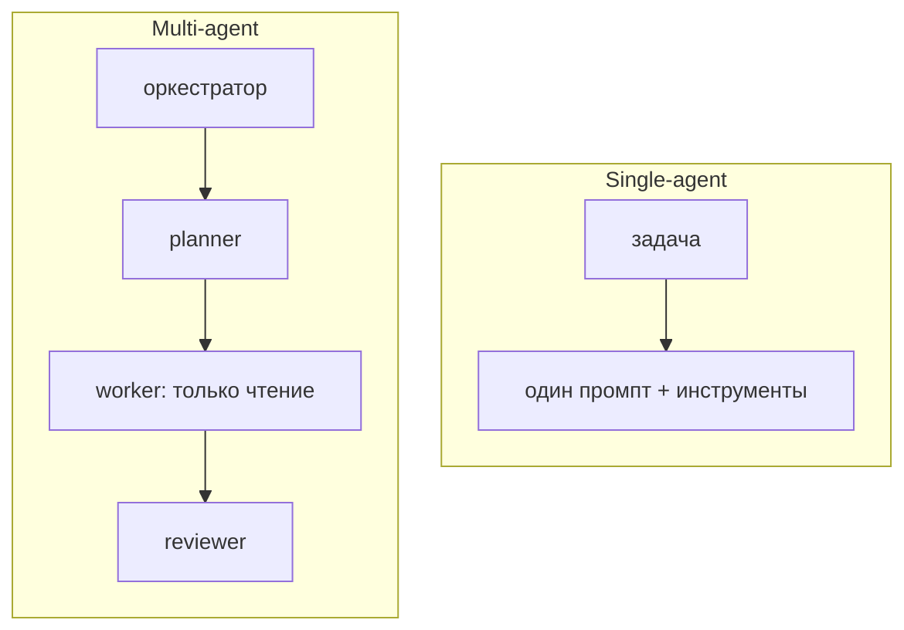

Разница не в числе промптов, а в том, кто принимает решения. В single-agent варианте переходы заданы кодом заранее. В multi-agent варианте отдельный компонент — **оркестратор**, то есть код, который по состоянию запуска решает, какая роль следующая, проверяет её входные данные и решает, что делать при отказе.

Три свойства, которые в разговорах смешивают, но в системе разделяют:

- **роль** — какая задача поручена модели и что она должна вернуть;
- **агентный runtime (среда выполнения агента)** — как модель получает инструменты, историю и разрешения: она видит только то, что среда ей передала;
- **оркестрация** — кто и по каким правилам вызывает следующую роль.

Несколько ролевых промптов в одном чате — это ещё не независимые агенты. Реальная система должна определить отдельные контексты, границы доступа, выходные данные, условия перехода и поведение при отказе.

Проверьте разницу на знакомой задаче кодинга: опишите её как контракт, а не как промпт.

```text
Задача/issue:
Критерии приёмки:
Какие файлы можно читать:
Какие файлы можно менять:
Разрешённые команды:
Запрещённые действия:
Кто принимает план:
Кто проверяет diff:
Условие остановки:
```

Если этот список нельзя заполнить, задача пока не готова к автоматизации — независимо от того, какая модель будет выполнять её.

### Практика {: .course-section .course-section--practice }

Возьмите 3–5 issue из подготовленного учебного набора. Для обязательного ядра:

1. зафиксируйте результат обычного одиночного coding agent на этих issue;
2. реализуйте минимальный процесс «planner → read-only analyst → implementer → проверка»;
3. повторите на том же issue и с теми же критериями, сравнив итоговый diff, тесты и время ручной проверки.

Не сравнивайте только стиль ответа: учитывайте выполнение критериев, регрессии, нарушения scope и количество ручных вмешательств. Не нужно строить три разные архитектуры.

**Расширение:** сравнить с «planner → implementer → reviewer» или распараллелить двух независимых read-only аналитиков.
{: .course-note .course-note--extension }

### Результат недели {: .course-section .course-section--result }

- baseline на 3–5 подготовленных задачах;
- выбранная задача для capstone;
- список измеряемых критериев;
- аргумент, почему выбранная задача выигрывает от multi-agent подхода.

**Обязательное ядро:** baseline и один кандидатный workflow.
{: .course-note .course-note--core }

**Расширение:** сравнение нескольких топологий на всём наборе.
{: .course-note .course-note--extension }

!!! rule "Rule"

    Сравнение с baseline — общий метод для любого workflow: сначала самый простой работающий вариант, потом измерение, и только затем усложнение.

---

## Неделя 2. Архитектуры: последовательность, manager-worker, DAG

<div class="week-brief">
<dl>
<dt>Что уже умеем</dt>
<dd>Передавать результат одного этапа другому.</dd>
<dt>Какую проблему решаем</dt>
<dd>При передаче теряется контекст — следующий этап догадывается.</dd>
<dt>Что нового появится</dt>
<dd>Передача результата между ролями по контракту, шесть топологий, таблица выбора.</dd>
<dt>Что получится в конце</dt>
<dd>Граф capstone с явными условиями и точками approval.</dd>
</dl>
</div>

### Материал

Неделя 1 остановилась там, где кончается фиксированный workflow: следующий шаг известен заранее. Дальше шаги начинают ветвиться, и на каждом развилке кто-то должен решить, какую роль звать и что ей передать. Так появляется handoff — и вместе с ним multi-agent:

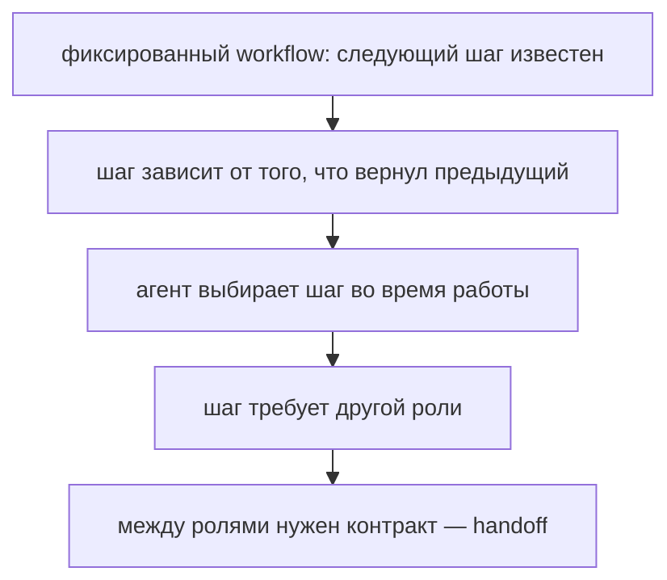

Сегодня мы на последнем пункте. Обратите внимание на условие: контракт между ролями появляется только тогда, когда ролей больше одной. Если задача целиком закрывается одним агентом, handoff в ней не нужен вовсе.

Посмотрим на типичный сбой, из которого растёт всё остальное. Планировщик закончил работу и передал результат дальше:

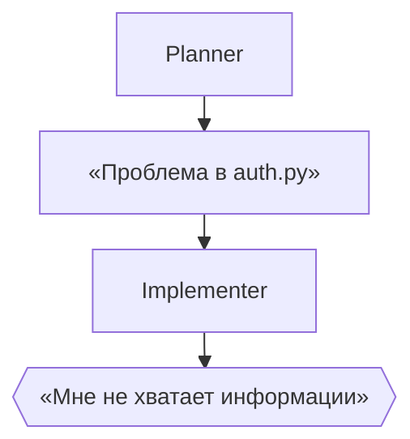

Ошибка не в моделях. Первый шаг передал слишком мало: не сказано, какая именно функция, при каких входных данных падает и какой тест это воспроизводит. Implementer вынужден либо угадать, либо остановиться. Оба варианта дорогие.

Что исправляет такую передачу, называется **handoff** — передача задачи и результата между этапами по фиксированному контракту. Контракт (или tool contract — тот же договор, если этап доступен как инструмент) задаёт, что обязательно присутствует в результате, и превращает «свободный текст» в проверяемую структуру:

```json
{
  "status": "complete | needs_input | blocked",
  "summary": "Краткое резюме результата",
  "evidence": [
    {"path": "src/module.py", "lines": "20-37", "claim": "причина связана с ..."}
  ],
  "assumptions": [],
  "open_questions": [],
  "next_action": "что должен сделать следующий узел",
  "files_changed": [],
  "commands_run": []
}
```

`evidence` — то, что превращает утверждение в проверку: следующий этап может открыть файл и убедиться сам. `open_questions` — защита от выдуманных ответов: вопрос остаётся вопросом, а не превращается в догадку в поле `summary`.

!!! why "Why it matters"

    Следующий шаг ждёт конкретную структуру, а модель может вернуть свободный текст или обрезанный JSON. Поэтому схему проверяет код — например Pydantic-моделью — до передачи дальше: иначе «успех» в свободном тексте пройдёт как структурированный результат, и ошибка обнаружится через два шага. По той же причине `blocked` и `needs_input` объявляются явно, а не подменяются частичным ответом с признаком успеха.

### Паттерны и выбор топологии

Реализуется одна топология. Таблица отвечает на два вопроса сразу: как работает паттерн и какой признак задачи на него указывает.

| Паттерн | Как работает | Какой признак задачи на него указывает |
|---|---|---|
| Sequential pipeline | шаги передаются по очереди | проверка должна идти после написания |
| Manager-worker | координатор делегирует независимые исследования и сводит результаты | два специалиста читают независимые модули |
| Map-reduce | одна операция над набором независимых элементов, потом свод | нужно свести вывод по many файлам |
| Router | классификатор выбирает один путь по типу задачи | маршрутизация по типу issue: bug / test / docs |
| Generator–critic | автор и проверяющий работают по разным критериям, цикл ограничен | агент меняет код по обратной связи |
| Supervisor | оркестратор выбирает следующий шаг по состоянию | задачи с ветвлениями; требует самых жёстких лимитов |

Не делайте агента ради названия паттерна: каждый вызов стоит времени, контекста, вычислений и добавляет вероятность расхождения. Перед добавлением роли ответьте на четыре вопроса: **почему недостаточно одного агента; какую отдельную ответственность получает новая роль; какова цена дополнительного handoff; каким измерением (eval) на том же baseline проверяется улучшение.** Если улучшения нет ни в качестве, ни в регрессиях, ни в соблюдении scope, оставьте более простую архитектуру.

### Практика {: .course-section .course-section--practice }

**Обязательное ядро:** нарисуйте один граф capstone и отметьте:
{: .course-note .course-note--core }

- какие узлы read-only;
- какие узлы имеют право создать diff;
- на каких ребрах требуется решение человека;
- какие ошибки завершают запуск;
- максимальное число попыток;
- где система должна остановиться при неизвестном.

**Расширение:** реализуйте второй паттерн и обоснуйте его измеримую пользу.
{: .course-note .course-note--extension }

!!! rule "Rule"

    Выбор топологии и явный handoff применимы к любому workflow, где этапы обмениваются ограниченными данными и имеют проверяемые условия перехода.

---

## Неделя 3. Контекст-инжиниринг и специализация ролей

<div class="week-brief">
<dl>
<dt>Что уже умеем</dt>
<dd>Передавать между этапами структуру, а не свободный текст.</dd>
<dt>Какую проблему решаем</dt>
<dd>Агент видит либо слишком мало контекста, либо слишком много.</dd>
<dt>Что нового появится</dt>
<dd>Context engineering, state, JIT-контекст, шаблоны ролей.</dd>
<dt>Что получится в конце</dt>
<dd>Шаблоны planner / analyst / reviewer и замер роли контекста.</dd>
</dl>
</div>

### Материал

Начнём с ситуации, в которой модель «плохая», а виноват контекст. Агенту дали issue и разрешение читать файлы, но не дали тест, который воспроизводит проблему. Он делает правку, которую не может ни объяснить, ни проверить. Модель здесь ни при чём: ей не дали то, что нужно для решения.

Это только один из четырёх типичных отказов — и все четыре лечатся не «лучшим промптом», а тем, что модель получает на конкретном шаге:

| Отказ | Как выглядит | Что делать |
|---|---|---|
| Контекста мало | Агент чинит баг, но не видел теста, который его воспроизводит, и меняет не тот файл | Дать недостающий артефакт до шага, а не замечать ошибку после |
| Контекста слишком много | История чата за сорок шагов: релевантное теряется в шуме, модель цепляется за отменённые решения | Собирать контекст заново из state, а не дописывать историю |
| Результаты инструментов нерелевантны | Агент прочитал 30 файлов и получил 4 нужные строки вперемешку с 400 строк лишнего | Ограничивать выдачу инструмента и всегда передавать источник |
| Контекст устарел | В state лежит вывод прошлой версии файла, а файл с тех пор изменили | Перепроверять факт по источнику при каждом чтении |

Так выглядит **context engineering** — проектирование того, какая информация доступна модели на каждом конкретном шаге. Контекст — не только промпт. В него входят инструкции системы и разработчика, история диалога, состояние задачи, определения инструментов и результаты их вызовов, найденные документы, внешние данные, ограничения и разрешения.

**Артефакт** — сохранённый результат шага: подтверждение `path:line`, diff, вывод теста, решение человека. Дальше по тексту артефакты не пересказывают, а цитируют по ссылке, чтобы следующий этап мог открыть их и проверить.

Два важных уточнения:

- **Права обеспечивает не текст.** Инструкция «не меняй чужие файлы» в промпте — это пожелание. Разрешения реально применяет runtime и policy: инструмент просто не получит доступ.
- **Контекст — это внимание, а не объём.** Длинная история чата не заменяет управляемое состояние: модель теряет релевантное в шуме.

State (состояние) — структурированный список уже известных фактов о прогрессе: критерии приёмки, найденные `path:line`, результаты тестов, что уже изменено, какой сейчас этап. Он передаётся между ролями вместо истории переписки.

Вместо передачи всего репозитория используйте Just-in-Time Context:

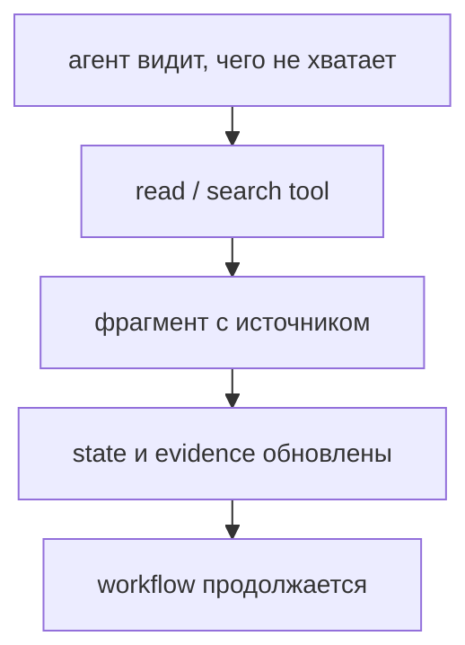

Например, repo analyst сначала получает issue, критерии и разрешённые пути, затем находит определения и тесты и передаёт implementer-у только подтверждённые `path:line`, нужные фрагменты и открытые вопросы. Так state связывает найденный контекст с задачей, не превращаясь в копию всей истории.

Coding agent чаще ошибается не из-за «слабого промпта», а потому что не получил нужный контракт, файлы, тесты или ограничение scope. Подавайте контекст слоями:

1. цель и критерии приёмки;
2. repo-specific правила и формат;
3. только релевантные файлы/фрагменты;
4. краткие результаты предыдущих ролей с evidence;
5. разрешения текущего этапа.

### Шаблон роли planner

```text
Ты — issue planner. Не редактируй файлы и не придумывай устройство репозитория.

Issue:
{issue}

Правила проекта:
{project_rules}

Верни JSON по схеме:
{
  "acceptance_criteria": ["..."],
  "unknowns": ["..."],
  "files_to_inspect": ["..."],
  "files_maybe_to_change": ["..."],
  "test_plan": ["..."],
  "risk_level": "low|medium|high",
  "needs_human_approval": true
}

Если критерий неоднозначен или изменение затрагивает данные/безопасность/API,
остановись со статусом needs_input.
```

### Шаблон роли repo analyst

```text
Ты — read-only аналитик репозитория. Файлы не меняй и команды не запускай.

Исследуй только эти пути:
{allowed_paths}

Issue и критерии:
{issue_and_acceptance}

Верни:
- найденные определения с path:line и коротким подтверждающим фрагментом;
- связи с вызывающим кодом и тестами;
- что осталось неизвестным;
- какие пути нужно исследовать дальше.

Не делай вывод о содержимом файла, которого не видел. Не предлагай широкую
перепись архитектуры, если минимальное изменение решает issue.
```

### Шаблон роли reviewer

```text
Ты — независимый reviewer diff. Код не меняй.

Issue/критерии:
{issue}

Diff:
{diff}

Результаты тестов:
{test_results}

На каждое замечание верни:
severity, file:line, нарушение, доказательство, сценарий отказа, уверенность.
Не сообщай о проблемах, которых нельзя подтвердить diff или тестом.
Отдельно напиши критерии, которые не удалось проверить.
```

### Практика {: .course-section .course-section--practice }

**Обязательное ядро:** на одном issue проверьте, помогает ли передача `path:line` evidence и типизированного результата по сравнению со свободным текстом.
{: .course-note .course-note--core }

**Короткое упражнение (5 минут):** возьмите issue из [Repo Triage](repo-triage.md) и составьте два входа analyst-у: полный текст README и истории либо минимальный контекст из issue, критериев, разрешённых путей и найденных фрагментов. Сравните релевантность evidence и объём переданного контекста.

**Расширение:** меняйте по одному параметру — размер контекста, подробность роли, формат результата — и сравните качество с ростом токенов. Промпты держите версионированными файлами.
{: .course-note .course-note--extension }

**Расширение:** retrieval как инструмент. Тот же приём в коде — ingestion, chunking, embeddings, vector search и отказ отвечать без источника — разобран в [RAG-лабораторной](rag-lab.md); найденные фрагменты считаются недоверенными данными с источником, как и любой вывод инструмента.
{: .course-note .course-note--extension }

!!! rule "Rule"

    Передача задачи между компонентами — это контекст с источниками, границами и открытыми вопросами. Работает для агентов, людей и внешних систем одинаково.

---

## Неделя 4. Подключение выбранного model provider

<div class="week-brief">
<dl>
<dt>Что уже умеем</dt>
<dd>Вызывать модель и проверять её ответ.</dd>
<dt>Какую проблему решаем</dt>
<dd>Неизвестно, отвечает ли провайдер в нужном интерфейсе.</dd>
<dt>Что нового появится</dt>
<dd>Smoke test, проверка structured output и tool calling.</dd>
<dt>Что получится в конце</dt>
<dd>Рабочий провайдер в конфиге или mock на замену.</dd>
</dl>
</div>

### Обязательное ядро {: .course-section .course-section--core }

Задача недели простая: получить один успешный ответ от выбранной модели и понять, чего от неё ждать дальше. Kilo привычен для ручного baseline, но как runtime capstone не подходит: агент в этой курсовой схеме — ваш Python-код, а не IDE. Выберите один доступный провайдер и выполните минимальный smoke test — одну проверку, что вызов вообще проходит. Запишите:

```text
Provider и модель:
Способ вызова (SDK/API/IDE):
Успешен ли короткий запрос:
Есть ли structured output или tool calling:
Latency первого и повторного запроса:
Какие ограничения/стоимость/приватность нужно учитывать:
```

**Structured output** — ответ модели в виде готовой структуры данных (JSON по схеме), а не свободного текста. Если провайдер умеет, это надёжнее парсинга текста; если не умеет, структуру получают **schema validation** — проверкой ответа по схеме на своей стороне. Tool calling — возможность выбрать инструмент и передать ему аргументы: именно он делает агентную схему возможной.

Если нет доступного model API, тесты и реализацию workflow можно продолжить с mock `ModelClient`; для демонстрации живого агентного прогона настройте Ollama или API-провайдера. Неудача с локальной моделью не блокирует остальные занятия.

### Расширение: локальная модель в Ollama, VS Code и Kilo {: .course-section .course-section--extension }

Если хотите работать локально или сравнить IDE-интеграции, пройдите [техническую лабораторную по Ollama/VS Code/Kilo](local-models.md). Она справочная и не является prerequisite следующих недель.

!!! rule "Rule"

    Адаптер провайдера отделяет логику приложения от конкретной компании: смена реализации не должна требовать переписывания workflow.

---

## Неделя 5. Provider-agnostic Python-оркестратор

<div class="week-brief">
<dl>
<dt>Что уже умеем</dt>
<dd>Есть роли и контракты, но переходы зависят от текста модели.</dd>
<dt>Какую проблему решаем</dt>
<dd>Между вызовами теряется состояние, провайдер протекает в логику.</dd>
<dt>Что нового появится</dt>
<dd>ModelClient, State, Workflow, HumanGate, RunPolicy — по проблеме на компонент, плюс бюджет.</dd>
<dt>Что получится в конце</dt>
<dd>Workflow с конечным бюджетом и тестами на mock.</dd>
</dl>
</div>

### Материал

К этому моменту у вас есть роли, контракты и измеренный baseline. Чего не хватает — кода, который удерживает состояние между ролями и умеет остановиться при отказе. Компоненты появляются в порядке боли: между вызовами теряется состояние → `State`; провайдер протекает в логику → `ModelClient`; переходы зависят от того, как модель сформулировала текст → `Workflow`; лимиты не соблюдаются → `RunPolicy`; опасное действие выполняется сразу → `HumanGate`. Пишите это на обычном Python, без фреймворка: framework пригодится позже, когда конкретная боль станет очевидной.

Первым в коде появляется **ModelClient**. Это адаптер, который прячет различия провайдеров: на входе сообщения и ограничения, на выходе типизированный результат или явная ошибка. Зачем он нужен — не изящество, а тестируемость: центральная логика workflow не знает про endpoint, поэтому её можно тестировать на mock, а провайдера менять без переписывания workflow.

Ответ модели проверяйте независимо от SDK: Pydantic, dataclass или jsonschema. Причина в порядке шагов — следующий узел ждёт конкретную структуру, а модель может вернуть свободный текст или обрезанный JSON. Обрабатывайте пустой результат, ошибку провайдера, timeout и превышение длины. Unit-тесты workflow используют fake/mock `ModelClient`, поэтому ни локальная модель, ни платный API не требуются.

### Компоненты

Не обязательно строить инфраструктуру целиком. Каждый компонент вводится только против конкретной проблемы:

| Компонент | Какую проблему решает | Объём |
|---|---|---|
| `State` | факты о прогрессе теряются между ролями | обязательное ядро |
| `ModelClient` | различия провайдеров, timeout и повторы не должны попадать в логику workflow | обязательное ядро |
| `Workflow` | переходы между ролями зависят от того, как модель сформулировала текст | обязательное ядро |
| `HumanGate` | опасное действие должно ждать подтверждения, а не выполняться сразу | обязательное ядро |
| `RunPolicy` | лимиты вызовов и повторов иначе не соблюдаются | обязательное ядро |
| `RoleRunner` | сборка сообщений для роли | упрощённая реализация, артефакты в памяти или файлах |
| `ArtifactStore` | prompts, outputs, diff и test results нужно хранить долго и с redaction | расширение |

### Один проход через эти компоненты

Теперь те же пять абстракций на одном реальном шаге — узле `planner`:

```text
Workflow: решить, что делать дальше; условие перехода — заполнены acceptance_criteria
  ↓ передаёт не текст, а поле state
State: {issue, acceptance_criteria[2], allowed_paths[], status: planning}
  ↓ собирает сообщение из state, инструкции роли и правил формата
RoleRunner → ModelClient: один вызов; на выходе — JSON по схеме или явная ошибка
  ↓ схема невалидна / пустой ответ / timeout
RunPolicy: один повтор с текстом ошибки, затем blocked — дальше не идём
  ↓ scope не подтверждён человеком
HumanGate: needs_approval, запись не выполняется
```

Один вызов — одно решение: где хранится факт, кто зовёт модель, что проверяется до вызова и что происходит после. Когда все пять компонентов на месте, этот проход одинаков для любой роли: `planner`, `analyst`, `reviewer` отличаются только содержимым state и инструкцией.

### Бюджет (обязательное ядро) и model routing (расширение)

Лимит вызовов — не оптимизация, а граница отказа: без конечного числа повторов цикл «попробовать ещё раз» превращается в зависший процесс, который выглядит как работа.

Зафиксируйте один провайдер и модель, установите конечные лимиты вызовов, времени и повторов. Не допускайте тихого переключения на другой или платный endpoint.

**Расширение:** добавьте **routing** — детерминированное правило, какая модель или обычный код обрабатывает какой тип шага:
{: .course-note .course-note--extension }

| Тип шага | Начальный выбор | Условие эскалации |
|---|---|---|
| Извлечение полей, нормализация, классификация | Маленькая локальная модель или обычный Python-код | Формат не прошёл schema validation или низкая уверенность |
| Анализ кода, планирование, сложный review | Привычная более сильная coding-модель; локальная — только после собственного eval | Не хватает доказательств, повторяется ошибка, высокий риск |
| Высокорисковое изменение / неоднозначные требования | Human gate до вызова implementer | Не эскалировать автоматически без лимита/разрешения |
| Простые проверки и маршрутизация | Python-правила, тесты и allowlist | Не вызывать LLM там, где достаточно детерминированной проверки |

Платный API для local-first пути не требуется. Облачный fallback необязателен и потенциально платен: он должен быть явно включён, иметь лимит и не получать приватный контекст без отдельного разрешения. Условия локального прогона — модель и тег, квантование, `num_ctx`, wall-clock, число вызовов, память — фиксируются по [странице о выборе модели](local-models.md).

**Расширение:** сравните две модели или провайдера на одном наборе задач; routing должен иметь явные лимиты и уметь вернуть `needs_input`/`blocked`, а не бесконечно переключать модели.
{: .course-note .course-note--extension }

### Состояние задачи

State из недели 3 теперь становится конкретной структурой. Минимальный набор полей, который реально используется в capstone:

```text
run_id
issue
acceptance_criteria[]
allowed_paths[]
plan
human_plan_approved
repo_evidence[]
test_plan[]
proposed_patch
commands_requested[]
commands_approved[]
test_results[]
review_findings[]
iteration_count
status: planning|needs_approval|implementing|testing|blocked|done
```

Секреты, `.env`, токены и содержимое credentials не должны попадать в промпты, артефакты логов или commit. Используйте `.gitignore`, redaction и отдельный учебный репозиторий.

### Практика {: .course-section .course-section--practice }

Соберите первую цепочку без автоматического shell:

```text
issue → planner → schema validation → человек утверждает план
     → read-only analyst → один отчёт
```

На выходе программа печатает артефакт и предлагает следующий шаг; она не меняет код. Добавьте тесты на invalid schema, provider timeout и `needs_input`.

!!! rule "Rule"

    Явные state, адаптер внешнего сервиса и конечные retry-бюджеты полезны в любом интеграционном workflow.

---

## Неделя 6. Tool calling, разрешения и policy

<div class="week-brief">
<dl>
<dt>Что уже умеем</dt>
<dd>Workflow вызывает модель и проверяет ответ по схеме.</dd>
<dt>Какую проблему решаем</dt>
<dd>Модель может предложить запись, и промпт её не остановит.</dd>
<dt>Что нового появится</dt>
<dd>Tool, policy, permission, approval, least privilege, guardrails — четыре уровня контроля.</dd>
<dt>Что получится в конце</dt>
<dd>Проверки allowlist и denied-сценарии в тестах.</dd>
</dl>
</div>

### Материал

Вот конкретная причина, по которой тема существует. Агенту дали инструмент `write_file(path, content)`. Инструкция в промпте гласит: «не трогай чужие файлы». Модель ошибается — и пишет куда-то ещё, потому что ограничение было в тексте, а не в системе.

Каждая из четырёх вещей ниже появляется из конкретной потребности, и каждая проверяет предыдущую:

| Потребность | Что вводим | Что это |
|---|---|---|
| Модели нужно что-то читать и менять | **Tool** | узкий интерфейс к системе: одно имя, одна ответственность, типизированные входы |
| Запрет в промпте не работает | **Policy** | код, который решает, можно ли действие вообще: allowlist путей и команд, лимиты, проверка аргументов |
| Правила общие, а роли разные | **Permission** | что конкретно разрешено этой роли: **least privilege** — ровно нужное и ничего больше |
| Часть действий необратима | **Human-in-the-loop** | точка, где человек подтверждает шаг с побочным эффектом; не заменяет остальные проверки, а дополняет |

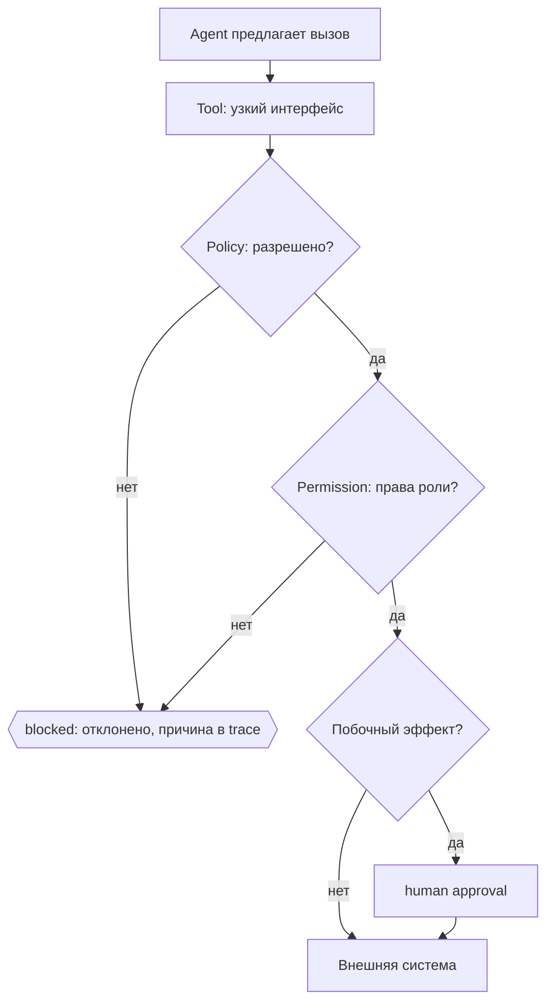

!!! key-idea "Key idea"

    Модель не определяет собственные права: она предлагает действие, код разрешает или отклоняет, и только затем инструмент исполняется. Провайдер модели сам по себе прав агента не задаёт.

Хороший тест: дать модели инструкцию вызвать только безопасный read-only инструмент и убедиться, что некорректный аргумент отклоняется до исполнения.

**Tool design — часть agent design.** Неясное имя, широкая ответственность или шумный ответ затрудняют правильный выбор даже при хорошем prompt. Для каждого tool задайте:

- понятное имя и одну узкую ответственность;
- явные типизированные входы и краткое описание, когда его применять;
- предсказуемый, ограниченный по объёму результат с источниками;
- actionable errors: что не получилось и какой безопасный следующий шаг возможен;
- минимальные данные в результате и permissions, необходимые именно этому действию.

**Упражнение (7 минут):** перепроектируйте условный tool `repo_action(action, path, command, content, recursive)`, который читает и меняет любые файлы и запускает произвольную команду. Разделите обязанности на узкие интерфейсы чтения/поиска и запуска allowlisted теста; определите schema, ошибки и permissions. Объясните, почему новый интерфейс проще выбрать модели; по возможности сравните оба варианта на том же issue/eval с точки зрения корректности выбора и объёма результата.

**Расширение:** те же правила на настоящей внешней системе разобраны в [Integration Lab](integration-lab.md): цепочка `tools → permissions → policy → approval → execution → trace` на локальном REST-сервисе, где API умеет удалить репозиторий, но ни один инструмент агента этот маршрут не оборачивает.
{: .course-note .course-note--extension }

Если tool registry становится большим, не добавляйте все определения в каждый model call:

```text
registry с краткими метаданными
→ обнаружение подходящего tool по текущей задаче
→ загрузка описания и schema только найденных tools
→ вызов через обычную policy-проверку
```

Это dynamic tool discovery, а не разрешение модели создавать произвольные инструменты: поиск ограничен registry, а найденный tool всё равно проходит allowlist, проверку аргументов и разрешений. **Короткое упражнение:** для каталога из 30 tools выберите 3–5, нужных issue про pytest failure, и укажите, какие определения не следует загружать в этот вызов.

### Минимальная политика для курса

**Guardrail (защитный барьер)** — любая автоматическая проверка, которая останавливает опасное действие до его выполнения: allowlist путей, проверка аргументов, запрет опасных команд. Политика ниже — это и есть guardrails конкретного workflow:

- читать только открытый учебный репозиторий и разрешённые подкаталоги;
- применять least privilege: выдавать каждой роли только необходимые права;
- проверять пути по allowlist и отклонять `..`, абсолютные и выходящие за корень пути;
- изменять только feature branch/worktree;
- не запускать shell-строки, составленные моделью, без просмотра человеком;
- хранить в конфиге allowlist точных тестовых команд; опасные команды (`rm`, `curl | sh`, `git push`, массовые миграции, публикация и деплой) не выполнять автоматически;
- не передавать модели secrets, `.env` и credentials; вывод инструментов и файлы проекта считать недоверенным контекстом, который может содержать prompt injection;
- перед изменением файла показывать diff;
- остановиться, если изменение выходит за scope утверждённого плана.

Для каждого IDE-инструмента (например, Kilo или Kodacode) разрешения настраиваются отдельно от вашего оркестратора.

**Blast radius** — потенциальный масштаб последствий ошибочного или неверно разрешённого действия. Эвристика: `agent autonomy × access scope → potential blast radius` (это не количественная формула). Для каждого нового tool (shell, filesystem, Git, external API) ответьте на четыре вопроса: что агент теперь может сделать; что произойдёт при ошибочном вызове; какие данные и побочные эффекты доступны; можно ли сузить permission без потери задачи. Ответ связывается с least privilege и policy выше: human approval дополняет, но не заменяет техническое ограничение доступа.

### Обязательное ядро {: .course-section .course-section--core }

На disposable-репозитории проверьте policy Python-workflow:

1. невалидный аргумент tool отклоняется до исполнения;
2. чтение и запись ограничены допустимыми путями;
3. запись и запуск команды требуют утверждения;
4. любое нарушение scope переводит запуск в `blocked`/`needs_approval`.

**Расширение:** повторить ручные сценарии в Kilo и/или Kodacode, сравнив их режимы разрешений с policy собственного оркестратора. Второй вариант — прогнать внешний API из [Integration Lab](integration-lab.md) и проверить, что право без approval, approval без права и отсутствие инструмента дают три разных отказа.
{: .course-note .course-note--extension }

!!! rule "Rule"

    Policy и least privilege — общие принципы авторизации: любой внешний инструмент получает только необходимый scope, а недоверенные данные не могут расширить его права.

---

## Неделя 7. Оценка качества, трассировка и регрессии

<div class="week-brief">
<dl>
<dt>Что уже умеем</dt>
<dd>Получить результат одного прогона.</dd>
<dt>Какую проблему решаем</dt>
<dd>Два workflow убедительны, но один не выполняет критерии приёмки.</dd>
<dt>Что нового появится</dt>
<dd>Eval с ground truth, метрики, trace, набор отказов.</dd>
<dt>Что получится в конце</dt>
<dd>Trace двух запусков и отчёт baseline vs workflow.</dd>
</dl>
</div>

### Материал

Оценка отвечает на вопрос, который нельзя решить вкусом. Два workflow выглядят одинаково убедительно, но один выполняет критерии приёмки, а другой нет. Разница видна только в измерении, и сделать его нужно до того, как архитектура усложнится:

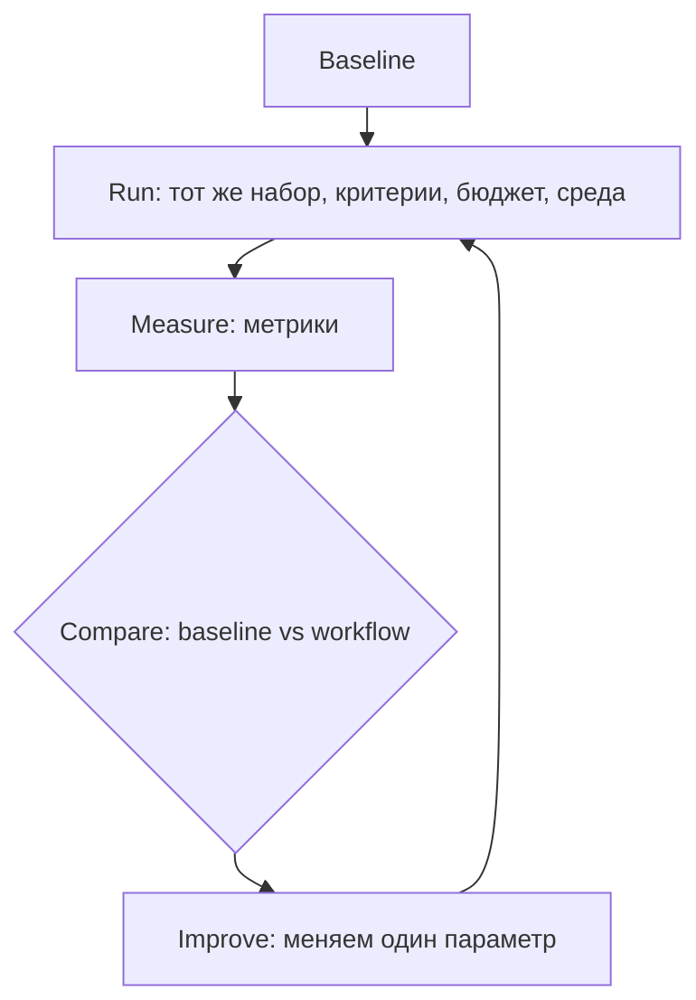

Цикл замкнут только тогда, когда на каждом шаге известно, что именно изменилось. Менять одновременно модель, промпт и архитектуру нельзя: иначе непонятно, что именно дало эффект.

**Eval (оценка)** — повторяемый прогон по набору задач с заранее известным правильным ответом. Такой известный ответ называется **ground truth**: для issue это воспроизводящий тест и критерии приёмки, для RAG — документ, в котором лежит ответ. Без ground truth метрика «выглядит нормально» ничего не значит.

Один прогон не значит ничего, пока его не с чем сравнить. Типичный результат сравнения двух вариантов на десяти учебных issue:

```text
baseline: один агент, один промпт          → 7 из 10 issue закрыты
вариант:  planner → read-only analyst      → 8 из 10 issue закрыты
          cost ×2.1, wall-clock ×1.7, ручных вмешательств столько же
```

Вопрос не «какой вариант лучше», а «оправдывают ли десять процентов дополнительных issue удвоение цены и времени». Если задача чувствительна к стоимости или к минутам проверки, правильный ответ — оставить baseline и записать причину. Если цена не важна, а качество растёт — оставляем новый вариант и фиксируем решение в отчёте. Eval отвечает не «кто победил», а «что выбрать».

Оценивать надо весь pipeline, а не только итоговый ответ. Для обязательного ядра достаточно 5–10 issue из стартового набора: фиксируйте ожидаемое поведение, версии промптов и провайдера, структурированные выходы, решения человека и тестовые результаты. Не используйте приватные репозитории как публичные eval-данные.

Отдельный слой — **trace** (трассировка), журнал событий прогона. Он отвечает на вопрос «почему»: какие узлы исполнялись, какие данные они получили, как выбрали tool, что инструмент вернул и почему система пошла по следующей ветке. Это не то же самое, что сохранять скрытые рассуждения модели: логируйте события и проверяемые артефакты.

!!! why "Why it matters"

    Eval говорит «плохо», trace — «почему». Метрика без трассировки показывает частоту отказа, но не позволяет найти переход, который надо исправить.

### Минимальная схема trace-события

```json
{
  "run_id": "uuid",
  "parent_run_id": null,
  "node_id": "repo_analyst",
  "attempt": 1,
  "model_id": "provider/model-or-local-tag",
  "prompt_version": "repo-analyst-v3",
  "input_artifact_refs": ["artifacts/run/issue.json"],
  "tool_name": null,
  "tool_arguments_redacted": null,
  "output_artifact_ref": "artifacts/run/repo-evidence.json",
  "status": "complete",
  "duration_ms": 1200,
  "error_type": null,
  "transition_reason": "evidence_schema_valid"
}
```

Сохраняйте tool result, exit code и trace spans отдельно от промпта, связывая их через `run_id`/`node_id`. Перед логированием удаляйте ключи, токены, персональные и иные чувствительные данные; задайте срок хранения. Не логируйте без разбора весь репозиторий, скрытые рассуждения модели или полный environment.

### Метрики

- issue resolution rate — выполнены ли критерии приёмки;
- regression rate — внесены ли новые ошибки;
- test pass rate — прошли ли определённые до изменения тесты;
- reviewer precision — доля полезных замечаний без ложных срабатываний;
- scope adherence — менялись ли только разрешённые пути;
- tool-call success — валидны ли аргументы и вызван ли правильный инструмент;
- human intervention — число вмешательств и минуты проверки;
- latency / tokens / memory — длительность и нагрузка локального прогона;
- cost — измеренная стоимость вызовов, если provider её сообщает.

Не сводите эти метрики в один «магический» score. Оценка нужна не только для проверки готового агента, но и для архитектурного выбора: сравните single-agent baseline и multi-agent workflow на одинаковых issue, критериях, лимитах и среде. Каждый дополнительный agent, handoff, tool или model call увеличивает latency, стоимость, сложность и поверхность отказов — оставляйте его только при измеримой пользе. LLM-as-judge допустим как дополнительный сигнал, но не как замена тестам и code review.

**Короткое упражнение (10 минут):** посчитайте те же метрики для retrieval на наборе из [RAG-лабораторной](rag-lab.md): какая доля поддерживаемых вопросов нашла ожидаемый документ, какая доля ответов целиком опирается на процитированный фрагмент и появились ли ответы без источника. Измеримый показатель полезнее объяснения, почему retrieval «выглядит работающим»: неподкреплённый ответ и релевантный, но неиспользованный контекст — разные отказы с разными исправлениями.

### Набор тестов на отказ

Для каждого отказа фиксируйте цепочку `failure → detection → recovery/escalation → final state`. Retry допускается только в заданном лимите; перед повтором tool с побочным эффектом проверяйте, не выполнился ли он уже.

| Failure | Detection | Recovery / escalation | Final state |
|---|---|---|---|
| Missing information / ambiguous request | Planner находит неизвестный критерий или конфликт требований | Задать конкретные вопросы; не запускать implementer | `needs_input` |
| Invalid structured output | Schema validation завершилась ошибкой | Один ограниченный повтор с ошибкой валидации; затем остановить pipeline | `blocked` |
| Tool failure / timeout | Явное исключение, timeout или отсутствующий результат/exit code | Ограниченный retry только для безопасной идемпотентной операции; иначе сообщить человеку | `blocked` |
| Policy violation / dangerous command | Policy отклоняет инструмент или аргументы до исполнения | Не исполнять; записать причину в trace и запросить review при необходимости | `blocked` |
| Scope violation | Сравнение предложенных путей с утверждённым scope | Отклонить изменение; запросить подтверждение расширения scope | `needs_approval` |
| Baseline/test failure | Runner сохраняет команду, exit code и вывод | Различить известный baseline failure и новую регрессию; при новой ошибке вернуть implementer-у ограниченную доработку | `done`, если проверки прошли; иначе `blocked` по лимиту |
| Reviewer loop | Повторные замечания/неизменившийся diff или исчерпан лимит итераций | Прекратить цикл, передать diff и нерешённые замечания человеку | `needs_approval` |
| Prompt injection в issue/tool output | Контент помечен как недоверенные данные; политика проверяет действие независимо от текста | Игнорировать инструкции из данных; запрещённое действие не запускать, событие записать | `blocked` при попытке нарушения |

### Протокол сравнения и практика {: .course-section .course-section--practice }

Сравните одиночного агента и multi-agent workflow на одинаковом наборе, с одинаковыми критериями, бюджетом и тестовой средой. Для каждого прогона зафиксируйте:

- выполнены ли acceptance criteria и прошли ли тесты;
- регрессии, нарушения scope и запрещённые действия;
- время, число вызовов и минуты человеческой проверки;
- провайдер и модель, версию промпта и настройки, необходимые для воспроизведения.

Не меняйте одновременно модель, промпт и архитектуру. Не требуется доказывать, что одна модель лучше другой; цель — выяснить, добавила ли оркестрация пользу в выбранном сценарии.

**Критерии приёмки эксперимента:** ни одного успешно выполненного запрещённого действия; каждый итог проверен тестом или человеком; отчёт явно показывает разницу в качестве/времени/вмешательствах. Если multi-agent вариант не лучше baseline, зафиксируйте этот результат, а не усложняйте систему без причины.

Добавьте к ключевым шагам trace-событие. Разберите неудачный запуск по trace и артефактам: найдите первый неверный переход и отделите ошибку модели от ошибки схемы или инструмента. **Расширение:** сравните локальную и облачную/IDE-модель или измените один параметр за раз.

**Артефакт недели:** trace одного успешного и одного неуспешного запуска, приватные поля отредактированы; короткий root-cause отчёт и регрессионный тест на найденную причину.

!!! rule "Rule"

    Метрики, traces и отказные сценарии позволяют сравнивать архитектуры любого автоматизированного workflow по качеству, стоимости и вмешательству человека.

---

## Неделя 8. Capstone и разбор архитектуры

<div class="week-brief">
<dl>
<dt>Что уже умеем</dt>
<dd>Измерить отдельную архитектуру на учебном наборе.</dd>
<dt>Какую проблему решаем</dt>
<dd>Неясно, нужна ли автоматизация и какую пользу она дала.</dd>
<dt>Что нового появится</dt>
<dd>Business framing в `problem-definition.md` и вертикальный срез.</dd>
<dt>Что получится в конце</dt>
<dd>Capstone с отчётом outcome против ожидания.</dd>
</dl>
</div>

### Сначала business framing

Capstone начинается не с кода, а с короткого документа `problem-definition.md` в вашем репозитории. Он отвечает на вопрос, какую задачу вы автоматизируете и почему для неё нужен именно agent-подход. Шаблон:

```markdown
# Problem
Какую конкретную проблему решаем? Для кого и как сейчас выглядит успех?

# Current process
Как задача выполняется сегодня, какими инструментами и сколько это занимает?

# Pain point
Что именно плохо: дорого, долго, много ручной работы, много ошибок,
сложно масштабировать, постоянное переключение между системами?

# Proposed automation
Что именно автоматизируем, а что остаётся за человеком?

# Why an agent
Почему здесь нужен agent или workflow — или почему достаточно
детерминированной автоматизации: скрипта, cron, ETL, правила в CI?

# Architecture choice
Workflow или автономный агент? Один агент или несколько?
Какие tools, какой state, где нужны permissions, где human approval,
где нужен RAG, где достаточно обычного кода?

# Expected outcome
Чем измеряем результат: time saved, success rate, error rate,
доля ручных вмешательств, cost per task, latency?

# Risks
Неверное действие, выдуманный ответ, утечка данных, избыточные права,
нежелательные побочные эффекты, неконтролируемый расход.
```

Документ отвечает на вопрос, который реализация не может решить за вас: **задача вообще требует агента?** Первым полезным выводом может оказаться отрицательный:

!!! takeaway "Здесь агент вообще не нужен"

Если процесс детерминированный — разбор issue по правилам, отчёт по расписанию, проверка соответствия шаблону, — правильное решение написать обычный код с тестами и объяснить это в `problem-definition.md`. Это хороший инженерный результат, а не неудача. Проверьте себя вопросом: **где в моей задаче нужна неоднозначность, которую нельзя заранее закодировать?** Если такого места нет, автономность добавит только стоимость, latency и новые точки отказа.

Обоснование архитектуры записывается в тот же документ, и техническое решение обязано на него ссылаться:

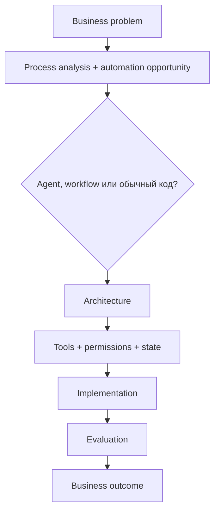

Заполненный `problem-definition.md` — часть артефактов сдачи. К этому моменту из предыдущих недель у вас уже есть baseline, измерения и критерии; framing просто связывает их с задачей, которую вы решаете, и позволяет сразу отказаться от агента там, где он лишний.

### Практика {: .course-section .course-section--practice }

Топология capstone та же, что в разделе «Архитектура курса» выше: planner → утверждение плана → read-only analyst → implementer → human approval → allowlisted tests → reviewer → отчёт. Требование недели — довести её до состояния, где каждый переход записан в trace, а лимиты вызовов конечны.

### Обязательные элементы и критерии завершения

Обязательный состав проекта и критерии, по которым он засчитывается, — один список: каждый пункт проверяем, иначе это пожелание.

- заполненный `problem-definition.md`, на который ссылается техническое решение, и ответ, почему выбран agent-подход, а не детерминированная автоматизация;
- один провайдер за интерфейсом `ModelClient` и конфигурация его модели;
- явные схемы handoff/state и конечные лимиты повторов;
- read-only analyst и ограниченный implementer;
- allowlist путей/команд, human approval до записи/исполнения — ни один shell command или file write не выполняется без политики и подтверждения;
- обработка invalid schema, ошибки провайдера и timeout без success-shaped fallback; недостающая информация даёт `needs_input`, а не выдуманный ответ;
- тесты happy path и хотя бы трёх отказов, trace успешного и неуспешного запуска; по каждому запуску объяснимо, почему сработал именно этот переход;
- конечный цикл ревью, минимум 5 сценариев учебного набора и README с запуском и известными ограничениями;
- отчёт, сравнивающий baseline и workflow по качеству, времени и доле ручной работы.

**Расширение:** отдельные specialist-роли, маршрутизация моделей, LangGraph, 10+ golden cases, checkpoint/resume и больше сценариев отказа.
{: .course-note .course-note--extension }

### Архитектурный review

В финале ответьте:

1. Какие разделения на роли дали измеримую пользу, а где оказалось достаточно одного агента?
2. Какой узел самый дорогой/медленный?
3. Какие два узла можно безопасно параллелить и на каких данных?
4. Какие общие ошибки все роли могут унаследовать?
5. Где существует риск утечки данных или чрезмерных разрешений?
6. Что заменится при переходе с локальной модели на облачную, а что должно остаться неизменным?
7. Что не следует автоматизировать даже при улучшении модели?
8. Совпал ли измеренный business outcome с ожиданием из `problem-definition.md`, и что вы изменили бы в следующей итерации?

### Короткие и длинные запуски агента

Короткий agent run завершается в одном ограниченном цикле. Долгий запуск упирается в другое: процесс прерывается, контекст переполняется, а сохранённые предположения устаревают. Одного `while not done: call_model()` мало — нужен **harness**, то есть внешняя обвязка, которая переживает сбой:

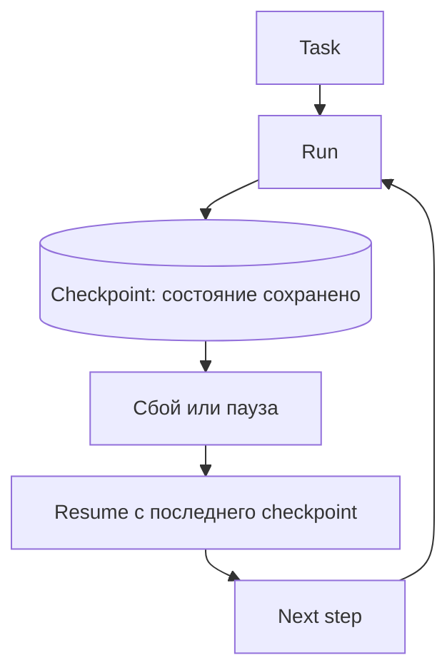

Checkpoint — сохранённое состояние запуска: какой узел завершён, какие артефакты существуют, что ждёт подтверждения. **Compaction** — сокращение контекста модели, чтобы освободить окно; она не заменяет checkpoint, потому что не сохраняет результат действия. **Idempotency** (идемпотентность) — свойство действия, которое можно повторить без вреда; именно она решает, допустим ли повтор после таймаута.

Поэтому для долгого запуска нужны: persistent state и checkpoints, проверяемый resume после сбоя, контролируемые compaction/reset, актуализация stale assumptions, bounded retries и явные stopping conditions. Связывайте это с human approval для значимых side effects, failure handling и trace, чтобы после восстановления было видно, что уже произошло и почему.

Подробная практика checkpoint/resume и idempotency — в неделе 12 [продвинутого трека](autonomous-agents.md); здесь достаточно объяснить, какие элементы нужны capstone, если его запуск выходит за один процесс.

### Что вы действительно освоили

После основного курса вы умеете:

- определить, нужен ли для задачи агент вообще, и выбрать single-agent или multi-agent архитектуру, обосновав выбор baseline/eval;
- декомпозировать workflow на роли и проверяемые handoff-контракты;
- проектировать state/context и подключать tools через runtime;
- ограничивать permissions, применять allowlist и ставить human approval;
- задавать отказные переходы, bounded retry, escalation и конечное состояние;
- количественно оценивать задачу, регрессии, scope, стоимость и latency;
- анализировать traces и находить причину неверного перехода;
- отделять неизменную архитектуру от заменяемых моделей, провайдеров и фреймворков.

!!! rule "Rule"

    Capstone — частный случай управляемой автоматизации: те же контракты, policy, recovery и eval применяются к любому workflow с моделями и внешними инструментами.

### Расширения после capstone {: .course-section .course-section--extension }

Необязательно подключите LangGraph и перенесите в него тот же workflow. Сравните сложность state/checkpoint, наблюдаемость и удобство тестирования с простым Python-кодом. Не переписывайте проект на framework, если это не решает конкретную проблему.

---

## Приложения

### Справочно: локальная модель

Подробные команды установки и подключения вынесены в [техническую лабораторную по локальным моделям](local-models.md) и [справочник подключения](ollama-vscode.md). Эта лабораторная нужна только для локальной дорожки.

### Источники и границы утверждений

- Полный список учебных и технических материалов, использованных при подготовке курса, собран в разделе [Источники и материалы для дальнейшего изучения](sources.md).

Модельные рекомендации и пользовательские интерфейсы меняются. Точные требования Ollama/Kilo следует сверять с актуальной документацией; оценка пригодности для 14 ГБ RAM — консервативный практический старт, а не гарантия производительности для неизвестной конфигурации GPU/CPU.
