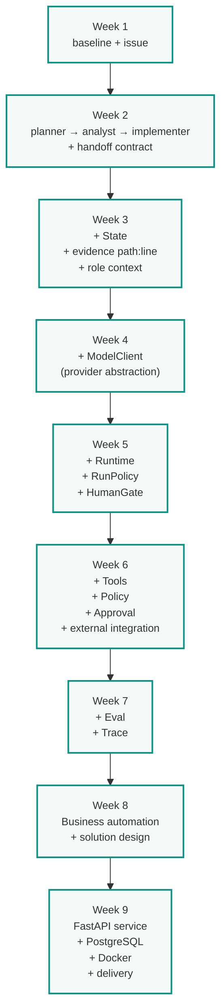

# Capstone: эволюция системы

Этот документ — spine курса. Вместо девяти оторванных задач вы развиваете **одну и ту же систему** от Week 1 до Week 9: agent, который безопасно решает issue в Python-репозитории. Каждая неделя меняет решение, а не заменяет Capstone.

> **Skill Lab ≠ Capstone.** Специализированные лаборатории (Taskboard, Repo Triage, RAG Lab, Integration Lab) учит механику изолированно. Capstone показывает, зачем эта механика нужна в реальной системе.

---

## Архитектурная эволюция



---

## Таблица эволюции

| Week | Capstone change | Student artifact |
|----|-----------------|------------------|
| 1 | baseline + candidate task | `problem-definition.md`, baseline, acceptance criteria, issue set |
| 2 | topology + handoff | capstone graph, handoff contract schema |
| 3 | context + state | `State` struct, `path:line` evidence, role templates |
| 4 | ModelClient | `ModelClient`, structured output validation, mock provider |
| 5 | runtime + policy | `Workflow`, `RunPolicy`, `HumanGate`, budget |
| 6 | tools + external integration | Tool registry, allowlist, approval gate, external API |
| 7 | evaluation + tracing | Eval report baseline vs workflow, trace of 2 runs |
| 8 | business automation + solution design | AS-IS / TO-BE, automation candidate, architecture choice, human boundary, measurable goals |
| 9 | production service | FastAPI, PostgreSQL, Docker, observability, CI, KPI report |

---

## Week 1 → Week 2

**Problem:** baseline работает, но передача результата между этапами теряется в свободном тексте — следующий этап догадывается.

**Change:** заменяем "один промпт" на цепочку ролей с фиксированным контрактом handoff: `planner → read-only analyst → implementer → review`.

**Reason:** каждая роль видит только то, что явно передано в контракте — а не всю историю переписки.

**Result:** student builds capstone graph с указанием read-only / write / human approval узлов.

---

## Week 2 → Week 3

**Problem:** агент видит либо слишком мало контекста (баг не воспроизводится), либо слишком много (история за 40 шагов теряет релевантное).

**Change:** вводим `State` — структурированный факты о прогрессе, `path:line` evidence вместо пересказа, JIT-контекст и role-specific шаблоны.

**Reason:** контекст — это внимание, а не объём. State передаётся между ролями вместо истории переписки.

**Result:** before/after:

```text
Week 2: agent receives issue
        → planner returns free text

Week 3: agent receives issue
        → planner fills State
        + repo_evidence with path:line
        + role-specific context
        + JIT context from read-only analyst
```

---

## Week 3 → Week 4

**Problem:** workflow завязан на конкретный provider SDK. Смена провайдера = переписывание бизнес-логики.

**Change:** выносим model call за `ModelClient` — тонкий адаптер. Workflow видит только `generate(messages, schema=...)` и `generate_with_tools(...)`.

**Reason:** модель становится заменяемой частью системы, а не частью бизнес-логики.

**Result:** student swaps provider (cloud → local) без изменения workflow кода; mock provider в тестах.

---

## Week 4 → Week 5

**Problem:** между вызовами теряется состояние, лимиты не соблюдаются, опасное действие выполняется сразу.

**Change:** формализуем runtime: `State → Role → Transition → RunPolicy → HumanGate`. RunPolicy задаёт конечный budget (calls, time, retries). HumanGate останавливает side effects.

**Reason:** без конечных retry-лимитов цикл «попробовать ещё раз» превращается в зависший процесс.

**Result:** student runs workflow с конечным бюджетом на mock; исчерпание retry после invalid schema → `failed`; policy rejection до tool execution → `blocked`; разрешённый side effect ждёт `needs_approval`.

В Week 9 Production Layer `needs_approval` — non-terminal persisted snapshot остановленного execution на HumanGate с `completed_at = null`. Сервис не предоставляет resume endpoint, поэтому это не полноценное возобновляемое состояние очереди.

---

## Week 5 → Week 6

**Problem:** модель может предложить запись, и промпт её не остановит — правило «не трогай чужие файлы» в тексте не работает.

**Change:** добавляем Tool registry с narrow schema, Policy check (allowlist путей/команд), Permission (least privilege per role), HumanGate для side effects.

**Reason:** разрешения реально применяет runtime и policy, а не текст промпта.

**Result:** Integration Lab учит механику изолированно, затем student переносит pattern в Capstone — тот же `Tool → Policy → Approval → Trace`, но уже в свой workflow.

---

## Week 6 → Week 7

**Problem:** два workflow выглядят одинаково убедительно, но один выполняет критерии приёмки, а другой нет. Разница видна только в измерении.

**Change:** запускаем Eval: ground truth, метрики (quality, cost, latency, human intervention), trace двух прогонов — baseline vs Week 6 system.

**Reason:** без измерения нельзя сравнить архитектуры. Каждое изменение должно иметь измеримую пользу.

**Result:** student produces eval report с разницей baseline vs multi-agent, root-cause из trace одного неудачного запуска.

---

## Week 7 → Week 8

**Problem:** качество workflow уже можно измерить, но неясно, какая часть процесса действительно заслуживает автоматизации и какой результат считать ценным.

**Change:** описываем AS-IS, находим pain points, сравниваем automation candidates, выбираем один участок и фиксируем TO-BE, уровень автономности, human boundary и KPI-цели.

**Reason:** сначала выбираем, что именно автоматизировать и почему выбранный механизм подходит; более сложная архитектура не является целью сама по себе.

**Result:** solution design Capstone обоснован и имеет измеримые цели; допустимый результат анализа — отказаться от агента, если надёжнее обычный код или workflow.

---

## Week 8 → Week 9

**Problem:** обоснованное решение пока остаётся workflow, который сложно вызвать извне, пережить между запросами и наблюдать как сервис.

**Change:** productionize тот же Capstone: FastAPI, PostgreSQL persistent state, external integration, async execution, secrets/config, Docker, observability, error handling и CI.

**Reason:** поставка не должна менять выбранную в Week 8 границу автоматизации и архитектуру; она делает решение доступным и проверяемым как production-like сервис.

**Result:** студент запускает сервис через `docker compose up`, проверяет его поведение и вручную сопоставляет измеренный outcome с KPI-целями Week 8. Отчёт `time saved`, `success rate`, `automation rate`, quality и cost не генерируются автоматически из Compose.

---

## Источники заимствований

| Skill Lab | Механика | Где применяется в Capstone |
|---|---|---|
| Taskboard | handoff contract, baseline test | Week 1-2 |
| Repo Triage | repository evidence, `path:line` | Week 3 |
| RAG Lab | JIT context, retrieval as tool | Week 3 (extension) |
| Integration Lab | Tool → Policy → Approval → Trace, external API | Week 6 → 9 |
