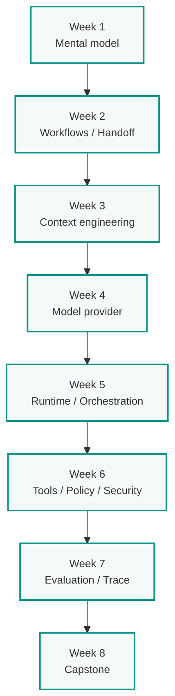

# Продвинутый практикум: мультиагентная разработка на Python

**Уровень:** для разработчика с практическим Python, Git и pytest. Опыт с Ollama, LangGraph, MCP и агентными фреймворками не требуется — они появляются в контексте инженерных задач.

**Ритм:** 8 недель, ориентир 3–5 часов в неделю на обязательное ядро.

**Основной результат:** минимальный проверяемый Python-workflow для безопасного решения задачи в кодовой базе.

**Инструменты:** Python, pytest и Git. Живой прогон требует model API через небольшой адаптер: локальный Ollama или уже доступный API-провайдер. Тесты пишутся с mock provider, поэтому платный API не обязателен.

---

## Зачем этот курс

Курс учит не основам программирования и не первым промптам, а построению проверяемого агентного процесса. Всё строится вокруг небольшого Python-репозитория: договорённости между этапами, ограничение действий, оценка качества и безопасная работа с изменениями.

---

## Кому подходит

- Разработчики, которые уже пишут на Python и хотят перейти от единичных промптов к системной автоматизации
- Команды, внедряющие AI-ассистентов в кодовую базу и нуждающиеся в контроле качества и безопасности
- Инженеры, которые хотят понять архитектуру агентных систем до выбора фреймворка

---

## Что студент умеет после курса

- Определить, нужен ли для задачи агент, и выбрать single-agent или multi-agent архитектуру
- Декомпозировать workflow на роли и проверяемые handoff-контракты
- Проектировать state/context и подключать tools через runtime
- Ограничивать permissions, применять allowlist и ставить human approval
- Задавать отказные переходы, bounded retry, escalation и конечное состояние
- Количественно оценивать задачу, регрессии, scope, стоимость и latency
- Анализировать traces и находить причину неверного перехода
- Отделять неизменную архитектуру от заменяемых моделей, провайдеров и фреймворков

---

## 8 недель

<div class="week-brief">
<dl>
<dt>Week 1</dt>
<dd>Mental model: baseline, workflow vs agent, первый capstone-кандидат</dd>
<dt>Week 2</dt>
<dd>Workflows / Handoff: топологии, контракты, граф capstone</dd>
<dt>Week 3</dt>
<dd>Context: context engineering, state, JIT-контекст, шаблоны ролей</dd>
<dt>Week 4</dt>
<dd>Model / Provider: smoke test, structured output, tool calling</dd>
<dt>Week 5</dt>
<dd>Runtime: ModelClient, State, Workflow, HumanGate, RunPolicy, бюджет</dd>
<dt>Week 6</dt>
<dd>Tools / Policy / Security: tool, policy, permission, approval, blast radius</dd>
<dt>Week 7</dt>
<dd>Evaluation: ground truth, trace, метрики, набор отказов, регрессии</dd>
<dt>Week 8</dt>
<dd>Capstone: problem-definition.md, вертикальный срез, business framing</dd>
</dl>
</div>



---

## Обязательное ядро vs Расширения

В курсе встречаются метки **Обязательное ядро** и **Расширение**. Выполнение расширений не требуется для зачёта основного курса — они для углубления.

| Неделя | Обязательное ядро | Расширение |
|---|---|---|
| 1 | baseline + один workflow-кандидат | сравнение топологий, параллельные аналитики |
| 2 | граф capstone с условиями перехода | реализация второго паттерна |
| 3 | передача `path:line` evidence | контекстные эксперименты, retrieval |
| 4 | smoke test выбранного провайдера | локальная модель в Ollama/VS Code/Kilo |
| 5 | Workflow с конечным бюджетом на mock | model routing, сравнение провайдеров |
| 6 | проверки allowlist, approval, denied-сценарии | сравнение с Kilo/Kodacode, Integration Lab |
| 7 | trace двух запусков, отчёт baseline vs workflow | retrieval eval, LLM-as-judge |
| 8 | `problem-definition.md`, вертикальный срез, отчёт | LangGraph, checkpoint/resume, 10+ golden cases |

---

## Учебный репозиторий

Используйте подготовленный [учебный репозиторий курса](../lab-repository.md) или создайте disposable Python-проект:

```text
src/
tests/
docs/
issues/
```

Подготовьте 5 основных issue: bug с тестом, «добавить тест», doc-правка с scope, `needs_input` кейс, edge case. **Расширение:** red-team issue с prompt injection (10 кейсов всего).

---

## Продолжение

После основного курса — [трек автономных агентов](../autonomous-agents.md): шесть модулей, из которых выбирают 1–2 под свою задачу.

---

## Навигация

| | |
|---|---|
| → | [Week 1: Mental model](week-1/) |