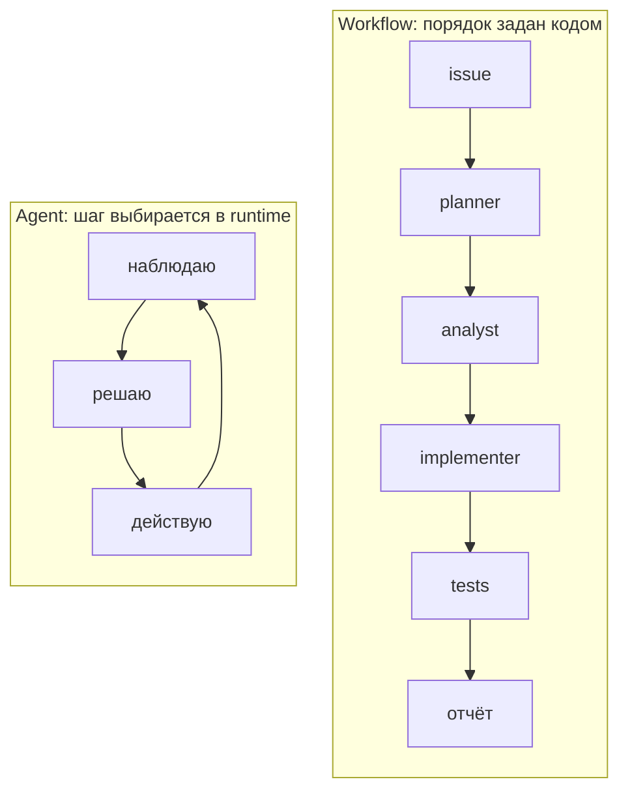
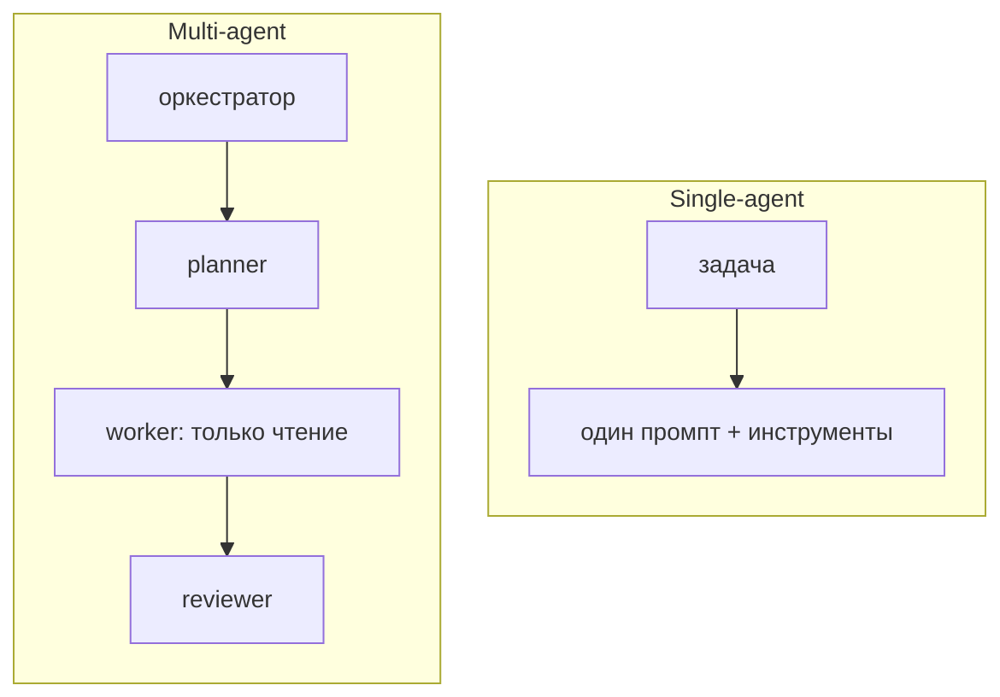

# Неделя 1. Переносим coding-agent практику в проверяемый процесс

<div class="week-brief">
<dl>
<dt>Что уже умеем</dt>
<dd>Python, Git, pytest, вызов модели по одному промпту.</dd>
<dt>Какую проблему решаем</dt>
<dd>По готовому ответу не видно, где агент ошибся, и не с чем сравнивать.</dd>
<dt>Что нового появится</dt>
<dd>Роль / агентный runtime / оркестрация и первый baseline.</dd>
<dt>Что получится в конце</dt>
<dd>Baseline и workflow-кандидат на 3–5 issue с критериями.</dd>
</dl>
</div>

---

!!! note "Что меняем в Capstone"
    **Week 1.** Создаём единый Capstone: `problem-definition.md`, baseline workflow и набор issue. Это первая версия системы, которую будем развивать еженедельно до Week 9.

## Материал

Сначала посмотрите на разницу, а потом на термины. **Workflow** — заранее написанная последовательность шагов, которую выполняет код. **Агент** решает ту же задачу иначе: следующий шаг он выбирает сам во время работы и может вернуться назад:



Два похожих на первый взгляд варианта делят код на роли:



Разница не в числе промптов, а в том, кто принимает решения. В single-agent варианте переходы заданы кодом заранее. В multi-agent варианте отдельный компонент — **оркестратор**, то есть код, который по состоянию запуска решает, какая роль следующая, проверяет её входные данные и решает, что делать при отказе.

Три свойства, которые в разговорах смешивают, но в системе разделяют:

- **роль** — какая задача поручена модели и что она должна вернуть;
- **агентный runtime (среда выполнения агента)** — как модель получает инструменты, историю и разрешения: она видит только то, что среда ей передала;
- **оркестрация** — кто и по каким правилам вызывает следующую роль.

Несколько ролевых промптов в одном чате — это ещё не независимые агенты. Реальная система должна определить отдельные контексты, границы доступа, выходные данные, условия перехода и поведение при отказе.

Проверьте разницу на знакомой задаче кодинга: опишите её как контракт, а не как промпт.

```text
Задача/issue:
Критерии приёмки:
Какие файлы можно читать:
Какие файлы можно менять:
Разрешённые команды:
Запрещённые действия:
Кто принимает план:
Кто проверяет diff:
Условие остановки:
```

Если этот список нельзя заполнить, задача пока не готова к автоматизации — независимо от того, какая модель будет выполнять её.

---

## Практика {: .course-section .course-section--practice }

Возьмите 3–5 issue из подготовленного учебного набора. Для обязательного ядра:

1. зафиксируйте результат обычного одиночного coding agent на этих issue;
2. реализуйте минимальный процесс «planner → read-only analyst → implementer → проверка»;
3. повторите на том же issue и с теми же критериями, сравнив итоговый diff, тесты и время ручной проверки.

Не сравнивайте только стиль ответа: учитывайте выполнение критериев, регрессии, нарушения scope и количество ручных вмешательств. Не нужно строить три разные архитектуры.

**Расширение:** сравнить с «planner → implementer → reviewer» или распараллелить двух независимых read-only аналитиков.
{: .course-note .course-note--extension }

---

## Результат недели {: .course-section .course-section--result }

- baseline на 3–5 подготовленных задачах;
- выбранная задача для capstone;
- список измеряемых критериев;
- аргумент, почему выбранная задача выигрывает от multi-agent подхода.

**Обязательное ядро:** baseline и один кандидатный workflow.
{: .course-note .course-note--core }

**Расширение:** сравнение нескольких топологий на всём наборе.
{: .course-note .course-note--extension }

!!! rule "Rule"
    Сравнение с baseline — общий метод для любого workflow: сначала самый простой работающий вариант, потом измерение, и только затем усложнение.

!!! takeaway "Capstone checkpoint"
    **Week 1.** `Baseline` готов: problem-definition, acceptance criteria и один workflow-кандидат на 3–5 issue.

---

## Навигация

| | |
|---|---|
| ← | [Курс: обзор](../) |
| → | [Week 2: Workflows / Handoff](week-2/) |