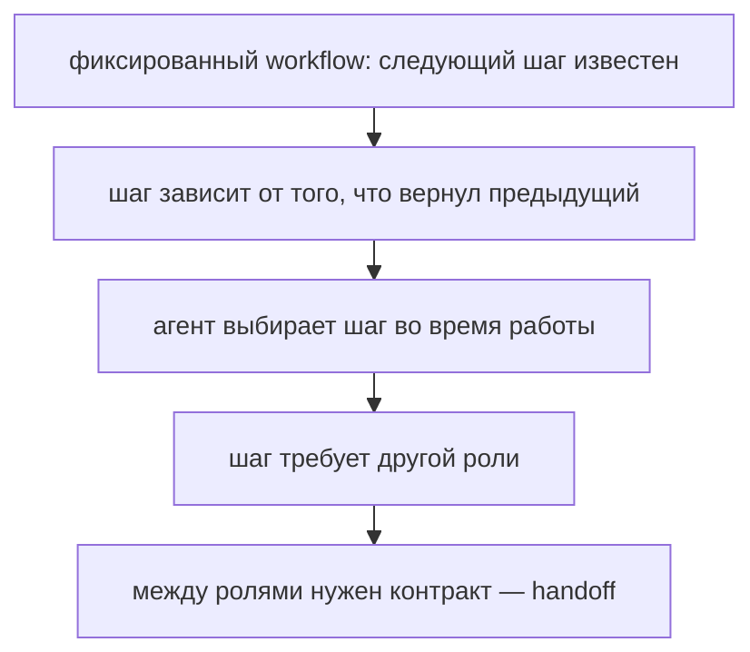
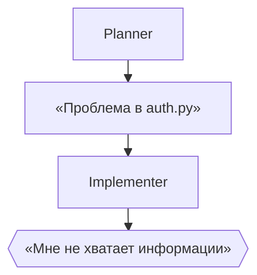

# Неделя 2. Архитектуры: последовательность, manager-worker, DAG

<div class="week-brief">
<dl>
<dt>Что уже умеем</dt>
<dd>Передавать результат одного этапа другому.</dd>
<dt>Какую проблему решаем</dt>
<dd>При передаче теряется контекст — следующий этап догадывается.</dd>
<dt>Что нового появится</dt>
<dd>Передача результата по контракту и три базовых topology patterns.</dd>
<dt>Что получится в конце</dt>
<dd>Граф capstone с явными условиями и точками approval.</dd>
</dl>
</div>

> 🧭 **Где мы:** LLM → Context / State → Tools → **[Runtime / Orchestration]** → Policy / Permissions → Evaluation / Observability.

---

!!! note "Что меняем в Capstone"
    **Week 2.** Берём baseline из Week 1 и превращаем его в explicit workflow: `planner → analyst → implementer → review` с handoff contract, transition conditions и failure states.

### Вспомни прошлую неделю

  1. Что именно сравнивали с baseline в Week 1?
  2. Где baseline уже используется в твоём Capstone?

## Материал

!!! question "🤔 Predict"
    Planner передал implementer-у только фразу «проблема в auth.py», без функции, воспроизводящего теста и ожидаемого результата. Что должен сделать надёжный следующий этап: угадать изменение или остановиться и запросить недостающие данные?

Неделя 1 остановилась там, где кончается фиксированный workflow: следующий шаг известен заранее. Дальше шаги начинают ветвиться, и на каждом развилке кто-то должен решить, какую роль звать и что ей передать. Так появляется handoff — и вместе с ним multi-agent:



Сегодня мы на последнем пункте. Обратите внимание на условие: контракт между ролями появляется только тогда, когда ролей больше одной. Если задача целиком закрывается одним агентом, handoff в ней не нужен вовсе.

Посмотрим на типичный сбой, из которого растёт всё остальное. Планировщик закончил работу и передал результат дальше:



Ошибка не в моделях. Первый шаг передал слишком мало: не сказано, какая именно функция, при каких входных данных падает и какой тест это воспроизводит. Implementer вынужден либо угадать, либо остановиться. Оба варианта дорогие.

Что исправляет такую передачу, называется **handoff** — передача задачи и результата между этапами по фиксированному контракту. Контракт (или tool contract — тот же договор, если этап доступен как инструмент) задаёт, что обязательно присутствует в результате, и превращает «свободный текст» в проверяемую структуру:

```json
{
  "status": "complete | needs_input | blocked | failed",
  "summary": "Краткое резюме результата",
  "evidence": [
    {"path": "src/module.py", "lines": "20-37", "claim": "причина связана с ..."}
  ],
  "assumptions": [],
  "open_questions": [],
  "next_action": "что должен сделать следующий узел",
  "files_changed": [],
  "commands_run": []
}
```

`evidence` — то, что превращает утверждение в проверку: следующий этап может открыть файл и убедиться сам. `open_questions` — защита от выдуманных ответов: вопрос остаётся вопросом, а не превращается в догадку в поле `summary`.

!!! why "Why it matters"
    Следующий шаг ждёт конкретную структуру, а модель может вернуть свободный текст или обрезанный JSON. Поэтому схему проверяет код — например Pydantic-моделью — до передачи дальше: иначе «успех» в свободном тексте пройдёт как структурированный результат, и ошибка обнаружится через два шага. По той же причине `blocked` и `needs_input` объявляются явно, а не подменяются частичным ответом с признаком успеха.

  Если вызов модели начался, но после ограниченных повторов не удалось получить валидный handoff, запуск завершается как `failed`. `blocked` означает отказ до исполнения, например policy rejection; `needs_input` — валидный результат, который выявил неоднозначность.

---

## Core: три паттерна и выбор топологии

Сначала достаточно различать три базовых способа организовать работу. Для Capstone выберите один подходящий паттерн; остальные пока нужны только для сравнения.

| Паттерн | Как работает | Какой признак задачи на него указывает |
|---|---|---|
| Sequential | этапы выполняются в заданном порядке | следующий шаг всегда известен; например, review после тестов |
| Router | классификатор выбирает один путь | тип задачи заранее определяет ветку: bug / test / docs |
| Manager-worker | координатор делегирует независимые части и сводит результаты | несколько исследовательских задач можно выполнять независимо |

Не добавляйте роли только ради названия паттерна: каждый handoff стоит времени и контекста. Выберите самый простой граф, который выполняет критерии capstone; расширять его стоит только при измеримой пользе.

### Другие распространённые паттерны — справочно

Их полезно узнавать в чужих системах, но не нужно запоминать или реализовывать для Core.

| Паттерн | Коротко |
|---|---|
| Map-reduce | применяет одну операцию к независимым элементам, затем объединяет результаты |
| Generator-critic | разделяет создание результата и его проверку; повторный цикл должен иметь предел |
| Supervisor | оркестратор выбирает следующий шаг по состоянию; требует особенно ясных условий остановки |

---

## Практика {: .course-section .course-section--practice }

**Обязательное ядро:** выберите один из трёх Core patterns и нарисуйте граф capstone. Отметьте:
{: .course-note .course-note--core }

- какие узлы read-only;
- какие узлы имеют право создать diff;
- на каких ребрах требуется решение человека;
- какие ошибки завершают запуск;
- максимальное число попыток;
- где система должна остановиться при неизвестном.

**Расширение:** реализуйте второй паттерн и обоснуйте его измеримую пользу.
{: .course-note .course-note--extension }

!!! success "🎉 What you can do now"
    Вы можете спроектировать handoff так, чтобы следующий узел получил проверяемые данные, а не был вынужден додумывать контекст.

!!! rule "Rule"
    Выбор топологии и явный handoff применимы к любому workflow, где этапы обмениваются ограниченными данными и имеют проверяемые условия перехода.

!!! takeaway "Результат недели: Capstone checkpoint"
    **Week 2.** `Topology + handoff contract` готовы: граф capstone с явными transition conditions, failure states и approval boundaries.

### Проверь себя

1. В чём разница между Sequential, Router и Manager-worker?
2. Почему Manager-worker не подходит, если этапы зависят друг от друга?
3. Какой handoff в твоём Capstone требует самого точного контракта?

## ✅ Definition of Done

- Выбрать Sequential, Router или Manager-worker по зависимостям задачи, а не по названию паттерна.
- Составить для Capstone handoff-контракт с результатом, evidence, открытыми вопросами и следующим действием.
- Нарисовать граф переходов с approval boundary, отказами и конечным числом попыток.
- Объяснить, как система обнаружит неполный handoff до запуска следующей роли.

> → **Дальше:** зафиксированный handoff даёт структуру, но ещё не гарантирует, что каждому шагу передаётся нужная информация. В Week 3 спроектируем context и state.

---

## Навигация

| | |
|---|---|
| ← | [Week 1: Mental model](week-1/) |
| → | [Week 3: Context engineering](week-3/) |