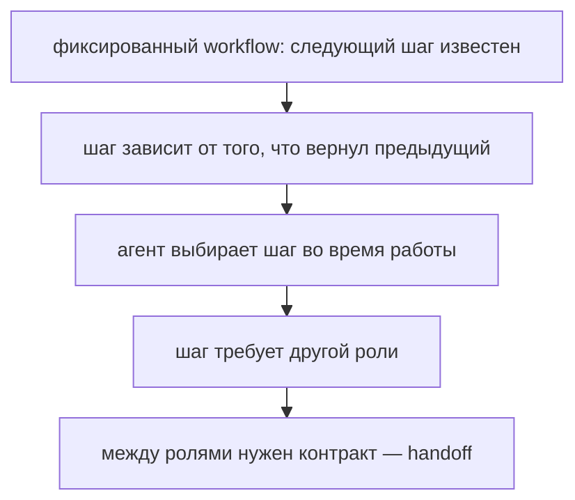
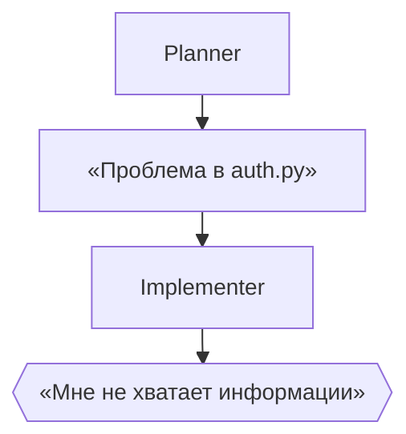

# Неделя 2. Архитектуры: последовательность, manager-worker, DAG

<div class="week-brief">
<dl>
<dt>Что уже умеем</dt>
<dd>Передавать результат одного этапа другому.</dd>
<dt>Какую проблему решаем</dt>
<dd>При передаче теряется контекст — следующий этап догадывается.</dd>
<dt>Что нового появится</dt>
<dd>Передача результата между ролями по контракту, шесть топологий, таблица выбора.</dd>
<dt>Что получится в конце</dt>
<dd>Граф capstone с явными условиями и точками approval.</dd>
</dl>
</div>

---

!!! note "Что меняем в Capstone"
    **Week 2.** Берём baseline из Week 1 и превращаем его в explicit workflow: `planner → analyst → implementer → review` с handoff contract, transition conditions и failure states.

## Материал

Неделя 1 остановилась там, где кончается фиксированный workflow: следующий шаг известен заранее. Дальше шаги начинают ветвиться, и на каждом развилке кто-то должен решить, какую роль звать и что ей передать. Так появляется handoff — и вместе с ним multi-agent:



Сегодня мы на последнем пункте. Обратите внимание на условие: контракт между ролями появляется только тогда, когда ролей больше одной. Если задача целиком закрывается одним агентом, handoff в ней не нужен вовсе.

Посмотрим на типичный сбой, из которого растёт всё остальное. Планировщик закончил работу и передал результат дальше:



Ошибка не в моделях. Первый шаг передал слишком мало: не сказано, какая именно функция, при каких входных данных падает и какой тест это воспроизводит. Implementer вынужден либо угадать, либо остановиться. Оба варианта дорогие.

Что исправляет такую передачу, называется **handoff** — передача задачи и результата между этапами по фиксированному контракту. Контракт (или tool contract — тот же договор, если этап доступен как инструмент) задаёт, что обязательно присутствует в результате, и превращает «свободный текст» в проверяемую структуру:

```json
{
  "status": "complete | needs_input | blocked",
  "summary": "Краткое резюме результата",
  "evidence": [
    {"path": "src/module.py", "lines": "20-37", "claim": "причина связана с ..."}
  ],
  "assumptions": [],
  "open_questions": [],
  "next_action": "что должен сделать следующий узел",
  "files_changed": [],
  "commands_run": []
}
```

`evidence` — то, что превращает утверждение в проверку: следующий этап может открыть файл и убедиться сам. `open_questions` — защита от выдуманных ответов: вопрос остаётся вопросом, а не превращается в догадку в поле `summary`.

!!! why "Why it matters"
    Следующий шаг ждёт конкретную структуру, а модель может вернуть свободный текст или обрезанный JSON. Поэтому схему проверяет код — например Pydantic-моделью — до передачи дальше: иначе «успех» в свободном тексте пройдёт как структурированный результат, и ошибка обнаружится через два шага. По той же причине `blocked` и `needs_input` объявляются явно, а не подменяются частичным ответом с признаком успеха.

---

## Паттерны и выбор топологии

Реализуется одна топология. Таблица отвечает на два вопроса сразу: как работает паттерн и какой признак задачи на него указывает.

| Паттерн | Как работает | Какой признак задачи на него указывает |
|---|---|---|
| Sequential pipeline | шаги передаются по очереди | проверка должна идти после написания |
| Manager-worker | координатор делегирует независимые исследования и сводит результаты | два специалиста читают независимые модули |
| Map-reduce | одна операция над набором независимых элементов, потом свод | нужно свести вывод по many файлам |
| Router | классификатор выбирает один путь по типу задачи | маршрутизация по типу issue: bug / test / docs |
| Generator–critic | автор и проверяющий работают по разным критериям, цикл ограничен | агент меняет код по обратной связи |
| Supervisor | оркестратор выбирает следующий шаг по состоянию | задачи с ветвлениями; требует самых жёстких лимитов |

Не делайте агента ради названия паттерна: каждый вызов стоит времени, контекста, вычислений и добавляет вероятность расхождения. Перед добавлением роли ответьте на четыре вопроса: **почему недостаточно одного агента; какую отдельную ответственность получает новая роль; какова цена дополнительного handoff; каким измерением (eval) на том же baseline проверяется улучшение.** Если улучшения нет ни в качестве, ни в регрессиях, ни в соблюдении scope, оставьте более простую архитектуру.

---

## Практика {: .course-section .course-section--practice }

**Обязательное ядро:** нарисуйте один граф capstone и отметьте:
{: .course-note .course-note--core }

- какие узлы read-only;
- какие узлы имеют право создать diff;
- на каких ребрах требуется решение человека;
- какие ошибки завершают запуск;
- максимальное число попыток;
- где система должна остановиться при неизвестном.

**Расширение:** реализуйте второй паттерн и обоснуйте его измеримую пользу.
{: .course-note .course-note--extension }

!!! rule "Rule"
    Выбор топологии и явный handoff применимы к любому workflow, где этапы обмениваются ограниченными данными и имеют проверяемые условия перехода.

!!! takeaway "Capstone checkpoint"
    **Week 2.** `Topology + handoff contract` готовы: граф capstone с явными transition conditions, failure states и approval boundaries.

---

## Навигация

| | |
|---|---|
| ← | [Week 1: Mental model](week-1/) |
| → | [Week 3: Context engineering](week-3/) |