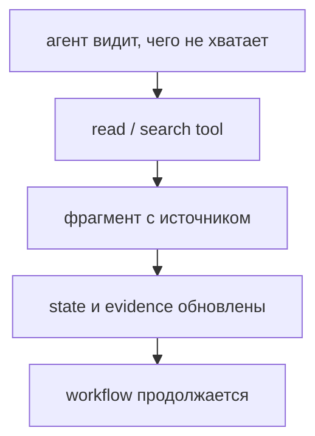

# Неделя 3. Контекст-инжиниринг и специализация ролей

<div class="week-brief">
<dl>
<dt>Что уже умеем</dt>
<dd>Передавать между этапами структуру, а не свободный текст.</dd>
<dt>Какую проблему решаем</dt>
<dd>Агент видит либо слишком мало контекста, либо слишком много.</dd>
<dt>Что нового появится</dt>
<dd>Context engineering, state, JIT-контекст, шаблоны ролей.</dd>
<dt>Что получится в конце</dt>
<dd>Шаблоны planner / analyst / reviewer и замер роли контекста.</dd>
</dl>
</div>

> 🧭 **Где мы:** LLM → **[Context / State]** → Tools → Runtime / Orchestration → Policy / Permissions → Evaluation / Observability.

---

!!! note "Что меняем в Capstone"
    **Week 3.** Добавляем State, `path:line` evidence и role-specific context. Передаём факты между ролями через структурированный State вместо истории переписки.

### Вспомни прошлую неделю

1. Назови три Core topology patterns из Week 2.
2. Какой паттерн использует твой Capstone и где происходит handoff?

## Материал

!!! question "🤔 Predict"
  Analyst нашёл нужный фрагмент кода, но сохранил в state только пересказ без пути и строк. Сможет ли reviewer проверить это утверждение после перехода к следующему шагу?

Начнём с ситуации, в которой модель «плохая», а виноват контекст. Агенту дали issue и разрешение читать файлы, но не дали тест, который воспроизводит проблему. Он делает правку, которую не может ни объяснить, ни проверить. Модель здесь ни при чём: ей не дали то, что нужно для решения.

Это только один из четырёх типичных отказов — и все четыре лечатся не «лучшим промптом», а тем, что модель получает на конкретном шаге:

| Отказ | Как выглядит | Что делать |
|---|---|---|
| Контекста мало | Агент чинит баг, но не видел теста, который его воспроизводит, и меняет не тот файл | Дать недостающий артефакт до шага, а не замечать ошибку после |
| Контекста слишком много | История чата за сорок шагов: релевантное теряется в шуме, модель цепляется за отменённые решения | Собирать контекст заново из state, а не дописывать историю |
| Результаты инструментов нерелевантны | Агент прочитал 30 файлов и получил 4 нужные строки вперемешку с 400 строк лишнего | Ограничивать выдачу инструмента и всегда передавать источник |
| Контекст устарел | В state лежит вывод прошлой версии файла, а файл с тех пор изменили | Перепроверять факт по источнику при каждом чтении |

Так выглядит **context engineering** — проектирование того, какая информация доступна модели на каждом конкретном шаге. Контекст — не только промпт. В него входят инструкции системы и разработчика, история диалога, состояние задачи, определения инструментов и результаты их вызовов, найденные документы, внешние данные, ограничения и разрешения.

**Артефакт** — сохранённый результат шага: подтверждение `path:line`, diff, вывод теста, решение человека. Дальше по тексту артефакты не пересказывают, а цитируют по ссылке, чтобы следующий этап мог открыть их и проверить.

!!! key-idea "Три роли информации"
  **State** — что система уже знает о задаче. **Context** — какую часть этих данных получает текущий шаг. **Evidence** — откуда известно каждое проверяемое утверждение.

Два важных уточнения:

- **Права обеспечивает не текст.** Инструкция «не меняй чужие файлы» в промпте — это пожелание. Разрешения реально применяет runtime и policy: инструмент просто не получит доступ.
- **Контекст — это внимание, а не объём.** Длинная история чата не заменяет управляемое состояние: модель теряет релевантное в шуме.

State (состояние) — структурированный список уже известных фактов о прогрессе: критерии приёмки, найденные `path:line`, результаты тестов, что уже изменено, какой сейчас этап. Он передаётся между ролями вместо истории переписки.

!!! takeaway "Before / after: Week 1 → Week 3"

| | Week 1 (baseline) | Week 3 (context + state) |
|---|---|---|
| Что получает агент | issue | issue + критерии + разрешённые пути |
| Контекст | один промпт, вся история чата | State с `path:line` evidence, role-specific templates |
| Доказательства | свободный текст | `path:line` с цитируемым фрагментом |
| Проблема | «модель не знает, где искать» | «модель видит только релевантное, с источниками» |

Вместо передачи всего репозитория используйте Just-in-Time Context:



Например, repo analyst сначала получает issue, критерии и разрешённые пути, затем находит определения и тесты и передаёт implementer-у только подтверждённые `path:line`, нужные фрагменты и открытые вопросы. Так state связывает найденный контекст с задачей, не превращаясь в копию всей истории.

Coding agent чаще ошибается не из-за «слабого промпта», а потому что не получил нужный контракт, файлы, тесты или ограничение scope. Подавайте контекст слоями:

1. цель и критерии приёмки;
2. repo-specific правила и формат;
3. только релевантные файлы/фрагменты;
4. краткие результаты предыдущих ролей с evidence;
5. разрешения текущего этапа.

---

## Шаблон роли planner

```text
Ты — issue planner. Не редактируй файлы и не придумывай устройство репозитория.

Issue:
{issue}

Правила проекта:
{project_rules}

Верни JSON по схеме:
{
  "acceptance_criteria": ["..."],
  "unknowns": ["..."],
  "files_to_inspect": ["..."],
  "files_maybe_to_change": ["..."],
  "test_plan": ["..."],
  "risk_level": "low|medium|high",
  "needs_human_approval": true
}

Если критерий неоднозначен или изменение затрагивает данные/безопасность/API,
остановись со статусом needs_input.
```

---

## Шаблон роли repo analyst

```text
Ты — read-only аналитик репозитория. Файлы не меняй и команды не запускай.

Исследуй только эти пути:
{allowed_paths}

Issue и критерии:
{issue_and_acceptance}

Верни:
- найденные определения с path:line и коротким подтверждающим фрагментом;
- связи с вызывающим кодом и тестами;
- что осталось неизвестным;
- какие пути нужно исследовать дальше.

Не делай вывод о содержимом файла, которого не видел. Не предлагай широкую
перепись архитектуры, если минимальное изменение решает issue.
```

---

## Шаблон роли reviewer

```text
Ты — независимый reviewer diff. Код не меняй.

Issue/критерии:
{issue}

Diff:
{diff}

Результаты тестов:
{test_results}

На каждое замечание верни:
severity, file:line, нарушение, доказательство, сценарий отказа, уверенность.
Не сообщай о проблемах, которых нельзя подтвердить diff или тестом.
Отдельно напиши критерии, которые не удалось проверить.
```

---

## Практика {: .course-section .course-section--practice }

**Обязательное ядро:** на одном issue проверьте, помогает ли передача `path:line` evidence и типизированного результата по сравнению со свободным текстом.
{: .course-note .course-note--core }

**Короткое упражнение (5 минут):** возьмите issue из [Repo Triage](../repo-triage.md) и составьте два входа analyst-у: полный текст README и истории либо минимальный контекст из issue, критериев, разрешённых путей и найденных фрагментов. Сравните релевантность evidence и объём переданного контекста.

**Расширение:** меняйте по одному параметру — размер контекста, подробность роли, формат результата — и сравните качество с ростом токенов. Промпты держите версионированными файлами.
{: .course-note .course-note--extension }

**Расширение:** retrieval как инструмент. Тот же приём в коде — ingestion, chunking, embeddings, vector search и отказ отвечать без источника — разобран в [RAG-лабораторной](../rag-lab.md); найденные фрагменты считаются недоверенными данными с источником, как и любой вывод инструмента.
{: .course-note .course-note--extension }

!!! success "🎉 What you can do now"
  Вы можете передать следующей роли только нужный контекст и дать ей способ перепроверить утверждения по источникам.

!!! rule "Rule"
    Передача задачи между компонентами — это контекст с источниками, границами и открытыми вопросами. Работает для агентов, людей и внешних систем одинаково.

!!! takeaway "Результат недели: Capstone checkpoint"
    **Week 3.** `Context/state design` готов: State struct с `path:line` evidence, role templates, JIT context.

### Проверь себя

1. Вспомни кратко: что такое State, Context и Evidence?
2. Чем State отличается от всей истории диалога?
3. Какое решение Capstone уже опирается на `path:line` evidence?

## ✅ Definition of Done

- Различать State, Context и Evidence на примере одного шага Capstone.
- Собрать для роли контекст из задачи, нужных фрагментов и источников вместо всей истории чата.
- Сверить переданный `path:line` с файлом и сравнить его пользу со свободным пересказом.
- Обнаружить устаревшее или неподкреплённое evidence и не передавать его дальше как факт.

---

## Навигация

| | |
|---|---|
| ← | [Week 2: Workflows / Handoff](week-2/) |
| → | [Week 4: Model provider](week-4/) |