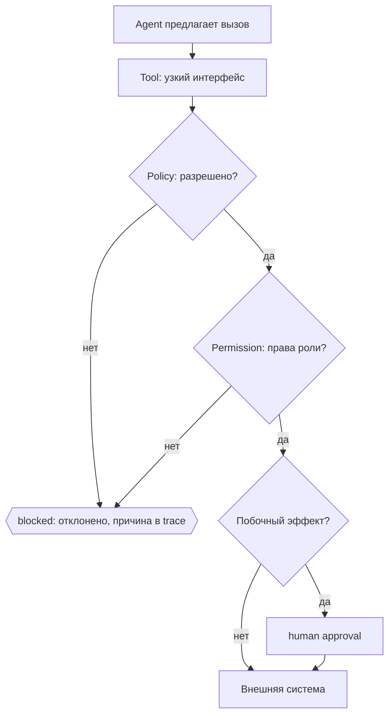

# Неделя 6. Tool calling, разрешения и policy

<div class="week-brief">
<dl>
<dt>Что уже умеем</dt>
<dd>Workflow вызывает модель и проверяет ответ по схеме.</dd>
<dt>Какую проблему решаем</dt>
<dd>Модель может предложить запись, и промпт её не остановит.</dd>
<dt>Что нового появится</dt>
<dd>Tool, policy, permission, approval, least privilege, guardrails — четыре уровня контроля.</dd>
<dt>Что получится в конце</dt>
<dd>Проверки allowlist и denied-сценарии в тестах.</dd>
</dl>
</div>

> 🧭 **Где мы:** LLM → Context / State → **[Tools]** → Runtime / Orchestration → **[Policy / Permissions]** → Evaluation / Observability.

---

!!! note "Что меняем в Capstone"
    **Week 6.** Добавляем tool registry, policy и permission boundary. Integration Lab учит механику изолированно — затем переносим `Tool → Policy → Approval → Trace` в наш Capstone workflow.

### Вспомни прошлую неделю

1. Какие ограничения `RunPolicy` удерживают workflow в рамках бюджета?
2. Где runtime должен остановить Capstone до side effect?

## Материал

!!! question "🤔 Predict"
    Prompt запрещает агенту писать за пределами разрешённого каталога, но модель всё равно предлагает `write_file("../secrets.txt", ...)`. Какая часть системы должна остановить действие и должен ли handler вообще быть вызван?

Вот конкретная причина, по которой тема существует. Агенту дали инструмент `write_file(path, content)`. Инструкция в промпте гласит: «не трогай чужие файлы». Модель ошибается — и пишет куда-то ещё, потому что ограничение было в тексте, а не в системе.

!!! question "🤔 Predict: human approval"
    Policy и permissions разрешили допустимую запись. Достаточно ли этого, чтобы выполнить её сразу, если действие необратимо?

Каждая из четырёх вещей ниже появляется из конкретной потребности, и каждая проверяет предыдущую:

| Потребность | Что вводим | Что это |
|---|---|---|
| Модели нужно что-то читать и менять | **Tool** | узкий интерфейс к системе: одно имя, одна ответственность, типизированные входы |
| Запрет в промпте не работает | **Policy** | код, который решает, можно ли действие вообще: allowlist путей и команд, лимиты, проверка аргументов |
| Правила общие, а роли разные | **Permission** | что конкретно разрешено этой роли: **least privilege** — ровно нужное и ничего больше |
| Часть действий необратима | **Human-in-the-loop** | точка, где человек подтверждает шаг с побочным эффектом; не заменяет остальные проверки, а дополняет |



!!! key-idea "Key idea"
    Модель не определяет собственные права: она предлагает действие, код разрешает или отклоняет, и только затем инструмент исполняется. Провайдер модели сам по себе прав агента не задаёт.

Хороший тест: дать модели инструкцию вызвать только безопасный read-only инструмент и убедиться, что некорректный аргумент отклоняется до исполнения.

**Tool design — часть agent design.** Неясное имя, широкая ответственность или шумный ответ затрудняют правильный выбор даже при хорошем prompt. Для каждого tool задайте:

- понятное имя и одну узкую ответственность;
- явные типизированные входы и краткое описание, когда его применять;
- предсказуемый, ограниченный по объёму результат с источниками;
- actionable errors: что не получилось и какой безопасный следующий шаг возможен;
- минимальные данные в результате и permissions, необходимые именно этому действию.

**Упражнение (7 минут):** перепроектируйте условный tool `repo_action(action, path, command, content, recursive)`, который читает и меняет любые файлы и запускает произвольную команду. Разделите обязанности на узкие интерфейсы чтения/поиска и запуска allowlisted теста; определите schema, ошибки и permissions. Объясните, почему новый интерфейс проще выбрать модели; по возможности сравните оба варианта на том же issue/eval с точки зрения корректности выбора и объёма результата.

**Расширение:** те же правила на настоящей внешней системе разобраны в [Integration Lab](../integration-lab.md): цепочка `tools → permissions → policy → approval → execution → trace` на локальном REST-сервисе, где API умеет удалить репозиторий, но ни один инструмент агента этот маршрут не оборачивает.
{: .course-note .course-note--extension }

Если tool registry становится большим, не добавляйте все определения в каждый model call:

```text
registry с краткими метаданными
→ обнаружение подходящего tool по текущей задаче
→ загрузка описания и schema только найденных tools
→ вызов через обычную policy-проверку
```

Это dynamic tool discovery, а не разрешение модели создавать произвольные инструменты: поиск ограничен registry, а найденный tool всё равно проходит allowlist, проверку аргументов и разрешений. **Короткое упражнение:** для каталога из 30 tools выберите 3–5, нужных issue про pytest failure, и укажите, какие определения не следует загружать в этот вызов.

---

## Минимальная политика для курса

**Guardrail (защитный барьер)** — любая автоматическая проверка, которая останавливает опасное действие до его выполнения: allowlist путей, проверка аргументов, запрет опасных команд. Политика ниже — это и есть guardrails конкретного workflow:

- читать только открытый учебный репозиторий и разрешённые подкаталоги;
- применять least privilege: выдавать каждой роли только необходимые права;
- проверять пути по allowlist и отклонять `..`, абсолютные и выходящие за корень пути;
- изменять только feature branch/worktree;
- не запускать shell-строки, составленные моделью, без просмотра человеком;
- хранить в конфиге allowlist точных тестовых команд; опасные команды (`rm`, `curl | sh`, `git push`, массовые миграции, публикация и деплой) не выполнять автоматически;
- не передавать модели secrets, `.env` и credentials; вывод инструментов и файлы проекта считать недоверенным контекстом, который может содержать prompt injection;
- перед изменением файла показывать diff;
- остановиться, если изменение выходит за scope утверждённого плана.

Для каждого IDE-инструмента (например, Kilo или Kodacode) разрешения настраиваются отдельно от вашего оркестратора.

**Blast radius** — потенциальный масштаб последствий ошибочного или неверно разрешённого действия. Эвристика: `agent autonomy × access scope → potential blast radius` (это не количественная формула). Для каждого нового tool (shell, filesystem, Git, external API) ответьте на четыре вопроса: что агент теперь может сделать; что произойдёт при ошибочном вызове; какие данные и побочные эффекты доступны; можно ли сузить permission без потери задачи. Ответ связывается с least privilege и policy выше: human approval дополняет, но не заменяет техническое ограничение доступа.

---

## Обязательное ядро {: .course-section .course-section--core }

На disposable-репозитории проверьте policy Python-workflow:

1. невалидный аргумент tool отклоняется до исполнения;
2. чтение и запись ограничены допустимыми путями;
3. запись и запуск команды требуют утверждения;
4. любое нарушение scope переводит запуск в `blocked`/`needs_approval`.

**Расширение:** повторить ручные сценарии в Kilo и/или Kodacode, сравнив их режимы разрешений с policy собственного оркестратора. Второй вариант — прогнать внешний API из [Integration Lab](../integration-lab.md) и проверить, что право без approval, approval без права и отсутствие инструмента дают три разных отказа.
{: .course-note .course-note--extension }

!!! success "🎉 What you can do now"
    Вы можете запретить исполнение tool вне allowlist и отделить проверку полномочий от подтверждения человеком.

!!! rule "Rule"
    Policy и least privilege — общие принципы авторизации: любой внешний инструмент получает только необходимый scope, а недоверенные данные не могут расширить его права.

!!! takeaway "Capstone checkpoint"
    **Week 6.** `Tool + permission boundary` работают: allowlist, scope, approval gate, external integration в Capstone.

### Проверь себя

1. Чем Policy отличается от Permission?
2. Почему approval не заменяет allowlist и проверку scope?
3. Какой side effect в Capstone требует HumanGate?

## ✅ Definition of Done

- Различать Tool, Policy, Permission и Human approval на одном предложенном действии.
- Ограничить tool аргументами, путями и правами, достаточными только для его задачи.
- Тестом подтвердить, что невалидный путь или аргумент отклоняется до вызова handler.
- Различать `blocked` до исполнения, `needs_approval` перед side effect и отказ после ошибки исполнения.

---

## Навигация

| | |
|---|---|
| ← | [Week 5: Runtime / Orchestration](week-5/) |
| → | [Week 7: Evaluation / Trace](week-7/) |