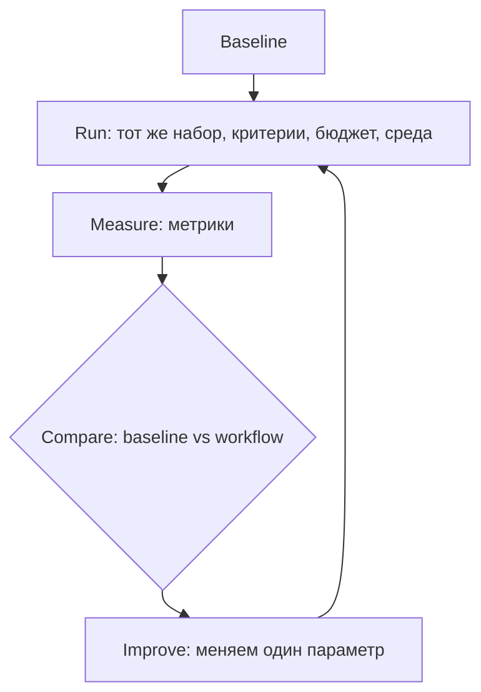

# Неделя 7. Оценка качества, трассировка и регрессии

<div class="week-brief">
<dl>
<dt>Что уже умеем</dt>
<dd>Получить результат одного прогона.</dd>
<dt>Какую проблему решаем</dt>
<dd>Два workflow убедительны, но один не выполняет критерии приёмки.</dd>
<dt>Что нового появится</dt>
<dd>Eval с ground truth, метрики, trace, набор отказов.</dd>
<dt>Что получится в конце</dt>
<dd>Trace двух запусков и отчёт baseline vs workflow.</dd>
</dl>
</div>

> 🧭 **Где мы:** LLM → Context / State → Tools → Runtime / Orchestration → Policy / Permissions → **[Evaluation / Observability]**.

---

!!! note "Что меняем в Capstone"
    **Week 7.** Сравниваем текущую систему с baseline из Week 1: eval с ground truth, метрики (quality, cost, latency, intervention), trace двух прогонов. Добавляем измеримую пользу каждого изменения.

### Вспомни прошлую неделю

1. Какие проверки должны пройти до исполнения tool?
2. Где в Capstone policy запрещает действие до вызова handler?

## Материал

!!! question "🤔 Predict"
  Два варианта workflow закрыли одинаковое число issue, но один тратит вдвое больше времени и model calls. Можно ли по одному числу issue сказать, что он лучше baseline?

Оценка отвечает на вопрос, который нельзя решить вкусом. Два workflow выглядят одинаково убедительно, но один выполняет критерии приёмки, а другой нет. Разница видна только в измерении, и сделать его нужно до того, как архитектура усложнится:



Цикл замкнут только тогда, когда на каждом шаге известно, что именно изменилось. Менять одновременно модель, промпт и архитектуру нельзя: иначе непонятно, что именно дало эффект.

**Eval (оценка)** — повторяемый прогон по набору задач с заранее известным правильным ответом. Такой известный ответ называется **ground truth**: для issue это воспроизводящий тест и критерии приёмки, для RAG — документ, в котором лежит ответ. Без ground truth метрика «выглядит нормально» ничего не значит.

Один прогон не значит ничего, пока его не с чем сравнить. Типичный результат сравнения двух вариантов на десяти учебных issue:

```text
baseline: один агент, один промпт          → 7 из 10 issue закрыты
вариант:  planner → read-only analyst      → 8 из 10 issue закрыты
          cost ×2.1, wall-clock ×1.7, ручных вмешательств столько же
```

Вопрос не «какой вариант лучше», а «оправдывают ли десять процентов дополнительных issue удвоение цены и времени». Если задача чувствительна к стоимости или к минутам проверки, правильный ответ — оставить baseline и записать причину. Если цена не важна, а качество растёт — оставляем новый вариант и фиксируем решение в отчёте. Eval отвечает не «кто победил», а «что выбрать».

Оценивать надо весь pipeline, а не только итоговый ответ. Для обязательного ядра достаточно 5–10 issue из стартового набора: фиксируйте ожидаемое поведение, версии промптов и провайдера, структурированные выходы, решения человека и тестовые результаты. Не используйте приватные репозитории как публичные eval-данные.

Отдельный слой — **trace** (трассировка), журнал событий прогона. Он отвечает на вопрос «почему»: какие узлы исполнялись, какие данные они получили, как выбрали tool, что инструмент вернул и почему система пошла по следующей ветке. Это не то же самое, что сохранять скрытые рассуждения модели: логируйте события и проверяемые артефакты.

!!! why "Why it matters"
    Eval говорит «плохо», trace — «почему». Метрика без трассировки показывает частоту отказа, но не позволяет найти переход, который надо исправить.

---

## Минимальная схема trace-события

```json
{
  "run_id": "uuid",
  "parent_run_id": null,
  "node_id": "repo_analyst",
  "attempt": 1,
  "model_id": "provider/model-or-local-tag",
  "prompt_version": "repo-analyst-v3",
  "input_artifact_refs": ["artifacts/run/issue.json"],
  "tool_name": null,
  "tool_arguments_redacted": null,
  "output_artifact_ref": "artifacts/run/repo-evidence.json",
  "status": "complete",
  "duration_ms": 1200,
  "error_type": null,
  "transition_reason": "evidence_schema_valid"
}
```

Сохраняйте tool result, exit code и trace spans отдельно от промпта, связывая их через `run_id`/`node_id`. Перед логированием удаляйте ключи, токены, персональные и иные чувствительные данные; задайте срок хранения. Не логируйте без разбора весь репозиторий, скрытые рассуждения модели или полный environment.

---

## Метрики

- issue resolution rate — выполнены ли критерии приёмки;
- regression rate — внесены ли новые ошибки;
- test pass rate — прошли ли определённые до изменения тесты;
- reviewer precision — доля полезных замечаний без ложных срабатываний;
- scope adherence — менялись ли только разрешённые пути;
- tool-call success — валидны ли аргументы и вызван ли правильный инструмент;
- human intervention — число вмешательств и минуты проверки;
- latency / tokens / memory — длительность и нагрузка локального прогона;
- cost — измеренная стоимость вызовов, если provider её сообщает.

Не сводите эти метрики в один «магический» score. Оценка нужна не только для проверки готового агента, но и для архитектурного выбора: сравните single-agent baseline и multi-agent workflow на одинаковых issue, критериях, лимитах и среде. Каждый дополнительный agent, handoff, tool или model call увеличивает latency, стоимость, сложность и поверхность отказов — оставляйте его только при измеримой пользе. LLM-as-judge допустим как дополнительный сигнал, но не как замена тестам и code review.

**Короткое упражнение (10 минут):** посчитайте те же метрики для retrieval на наборе из [RAG-лабораторной](../rag-lab.md): какая доля поддерживаемых вопросов нашла ожидаемый документ, какая доля ответов целиком опирается на процитированный фрагмент и появились ли ответы без источника. Измеримый показатель полезнее объяснения, почему retrieval «выглядит работающим»: неподкреплённый ответ и релевантный, но неиспользованный контекст — разные отказы с разными исправлениями.

---

## Набор тестов на отказ

Для каждого отказа фиксируйте цепочку `failure → detection → recovery/escalation → final state`. Retry допускается только в заданном лимите; перед повтором tool с побочным эффектом проверяйте, не выполнился ли он уже.

| Failure | Detection | Recovery / escalation | Final state |
|---|---|---|---|
| Missing information / ambiguous request | Planner находит неизвестный критерий или конфликт требований | Задать конкретные вопросы; не запускать implementer | `needs_input` |
| Invalid structured output | Schema validation завершилась ошибкой во время execution | Один ограниченный повтор; если ответ всё ещё невалиден — сохранить причину и завершить запуск | `failed` |
| Tool failure / timeout | Явное исключение, timeout или отсутствующий результат/exit code после начала tool execution | Ограниченный retry только для безопасной идемпотентной операции; затем сообщить человеку и сохранить trace | `failed` |
| External API error | Вызванный tool получил ошибку внешней системы | Применить retry policy только если операция идемпотентна; после исчерпания budget завершить запуск | `failed` |
| Policy violation / dangerous command | Policy отклоняет инструмент или аргументы до исполнения | Не исполнять; записать причину в trace и запросить review при необходимости | `blocked` |
| Missing scope | Permission check не разрешает tool до вызова handler | Не вызывать handler или внешний API; сохранить причину отказа | `blocked` |
| Scope violation | Сравнение предложенных путей с утверждённым scope | Отклонить изменение; запросить подтверждение расширения scope | `needs_approval` |
| Baseline/test failure | Runner сохраняет команду, exit code и вывод | Различить известный baseline failure и новую регрессию; после исчерпания ограниченных исправлений завершить запуск | `failed` при неисправленной регрессии |
| Reviewer loop | Повторные замечания/неизменившийся diff или исчерпан лимит итераций | Прекратить цикл, передать diff и нерешённые замечания человеку | `needs_approval` |
| Prompt injection в issue/tool output | Контент помечен как недоверенные данные; политика проверяет действие независимо от текста | Игнорировать инструкции из данных; запрещённое действие не запускать, событие записать | `blocked` при попытке нарушения |

---

## Таблица эволюции Capstone

Сравните каждую версию системы на одном и том же наборе issue, критериях и среде. Цифры — результат реального student run или example (в example помечены явно).

| Версия | Архитектура | Качество | Стоимость | Latency | Ручные вмешательства |
|---|---|---|---|---|---|
| v1 (Week 1) | baseline: один агент, один промпт | ... | ... | ... | ... |
| v2 (Week 2) | workflow + handoff | ... | ... | ... | ... |
| v3 (Week 3) | + context/state | ... | ... | ... | ... |
| v4 (Week 4) | + ModelClient | ... | ... | ... | ... |
| v5 (Week 5) | + runtime/policy | ... | ... | ... | ... |
| v6 (Week 6) | + tools/permissions | ... | ... | ... | ... |
| v7 (Week 7) | полная система | ... | ... | ... | ... |

Каждая строка — результат одного прогона. Не меняйте одновременно модель, промпт и архитектуру: иначе непонятно, что именно дало эффект.

---

## Протокол сравнения и практика {: .course-section .course-section--practice }

Сравните одиночного агента и multi-agent workflow на одинаковом наборе, с одинаковыми критериями, бюджетом и тестовой средой. Для каждого прогона зафиксируйте:

- выполнены ли acceptance criteria и прошли ли тесты;
- регрессии, нарушения scope и запрещённые действия;
- время, число вызовов и минуты человеческой проверки;
- провайдер и модель, версию промпта и настройки, необходимые для воспроизведения.

Не меняйте одновременно модель, промпт и архитектуру. Не требуется доказывать, что одна модель лучше другой; цель — выяснить, добавила ли оркестрация пользу в выбранном сценарии.

**Критерии приёмки эксперимента:** ни одного успешно выполненного запрещённого действия; каждый итог проверен тестом или человеком; отчёт явно показывает разницу в качестве/времени/вмешательствах. Если multi-agent вариант не лучше baseline, зафиксируйте этот результат, а не усложняйте систему без причины.

Добавьте к ключевым шагам trace-событие. Разберите неудачный запуск по trace и артефактам: найдите первый неверный переход и отделите ошибку модели от ошибки схемы или инструмента. **Расширение:** сравните локальную и облачную/IDE-модель или измените один параметр за раз.
{: .course-note .course-note--extension }

!!! success "🎉 What you can do now"
  Вы можете решить по одинаковому eval-набору, даёт ли workflow измеримую пользу, и найти по trace причину сбоя.

**Артефакт недели:** trace одного успешного и одного неуспешного запуска, приватные поля отредактированы; короткий root-cause отчёт и регрессионный тест на найденную причину.

!!! rule "Rule"
    Метрики, traces и отказные сценарии позволяют сравнивать архитектуры любого автоматизированного workflow по качеству, стоимости и вмешательству человека.

!!! takeaway "Результат недели: Capstone checkpoint"
    **Week 7.** `Eval report` готов: сравнение baseline vs workflow, trace двух запусков, root-cause analysis.

### Проверь себя

1. Чем evaluation отличается от trace?
2. Когда один и тот же итог — `blocked`, а когда — `failed`?
3. Какой baseline и регрессионный сценарий теперь защищают Capstone?

## ✅ Definition of Done

- Объяснить, чем eval отвечает на вопрос «насколько хорошо», а trace — «почему так произошло».
- Сравнить baseline и workflow на одинаковом наборе задач, критериях и бюджете.
- Записать trace успешного и неуспешного запуска, затем проверить вывод тестом или артефактом.
- Отличить отказ до исполнения (`blocked`) от ошибки исполнения/исчерпания retry (`failed`) и добавить regression case для найденной причины.

> → **Дальше:** eval показывает техническое качество, но не отвечает, какую часть процесса вообще стоит автоматизировать. В Week 8 выберем бизнес-цель и достаточный уровень решения.

---

## Навигация

| | |
|---|---|
| ← | [Week 6: Tools / Policy / Security](week-6/) |
| → | [Week 8: Capstone](week-8/) |