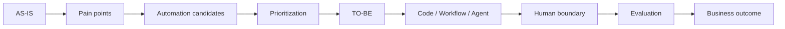

# Неделя 8. Business Automation & Solution Design

<div class="week-brief">
<dl>
<dt>Что уже умеем</dt>
<dd>Сравнивать workflow по качеству, trace, времени и ручным вмешательствам.</dd>
<dt>Какую проблему решаем</dt>
<dd>Неясно, какую часть бизнес-процесса стоит автоматизировать и нужен ли здесь агент.</dd>
<dt>Что нового появится</dt>
<dd>Process analysis, приоритизация automation candidates и обоснованный solution design Capstone.</dd>
<dt>Что получится в конце</dt>
<dd>Спроектированная система с выбранной границей автоматизации, архитектурой и измеримыми целями.</dd>
</dl>
</div>

---

!!! note "Что меняем в Capstone"
    **Week 8.** Не начинаем новый проект. Выбираем бизнес-процесс, уточняем automation opportunity и фиксируем, какую систему будем строить. Уже знакомый Capstone становится конкретным решением с обоснованной границей автоматизации.

## Сначала business framing

Не всякая повторяющаяся задача требует агента. Например, команда вручную разбирает входящие issue: часть полей можно проверять обычными правилами, часть контекста приходится искать в репозитории, а решение о записи или изменении кода остаётся за человеком. Сначала разберитесь в процессе, затем выбирайте механизм.

Начните с короткого документа `problem-definition.md` в Capstone-репозитории. Не нужна BPMN-модель: достаточно последовательного списка или простой схемы.

### AS-IS: как процесс работает сейчас

Опишите:

1. Что запускает процесс.
2. Какие шаги выполняются и в каком порядке.
3. Где и какое решение принимает человек.
4. Какие системы, файлы или API используются.
5. Где появляется результат и кто его использует.

### Pain points: где процесс теряет время или качество

Для проблемного этапа отметьте ручной труд, задержки, ошибки и повторяющиеся действия; укажите стоимость, узкие места и риски, если это известно. Не автоматизируйте весь процесс только потому, что это возможно.

### Automation candidates: что можно автоматизировать

Выберите 2–3 конкретных этапа процесса. Для оценок достаточно `low / medium / high`; точная математическая модель не нужна.

| Candidate | Frequency | Manual effort | Ambiguity | Risk | Data/API availability | Automation fit |
|---|---:|---:|---:|---:|---|---:|
| A | | | | | | |
| B | | | | | | |
| C | | | | | | |

Выберите один основной кандидат. Хороший выбор сочетает высокую ценность, достаточную автоматизируемость, приемлемый риск и доступные данные/API. В 2–3 предложениях объясните, почему выбрали именно этот участок.

### TO-BE: как будет работать выбранное решение

Опишите целевой процесс по шагам:

1. Trigger — что запускает систему.
2. Agent / workflow — какие действия выполняются автоматически.
3. Tools / integrations — какие данные и системы используются.
4. Human approval — где требуется решение человека.
5. Side effect — что система вправе изменить или отправить.
6. Result / persistence — где сохраняется результат и как его получить.

```text
AS-IS → где теряется время или качество
TO-BE → что именно теперь делает система
```

### Выбор уровня решения

Для выбранного кандидата сравните подходящие варианты: **Code**, **Workflow**, **LLM workflow** или **Agent**. Используйте самый простой механизм, который решает задачу надёжно.

Объясните кратко:

- почему выбран именно этот уровень автономности;
- почему более простой вариант недостаточен;
- почему более сложный вариант не оправдан.

Иногда правильный ответ — обычный код. Если процесс детерминированный, например проверка полей или отчёт по расписанию, агент добавит стоимость, задержки и новые точки отказа без пользы.

### Human boundary

Зафиксируйте границу автономности в `problem-definition.md`:

```text
Agent can do autonomously:
...

Human must approve / decide:
...
```

Свяжите её с уже знакомыми `Policy`, permissions и Human-in-the-loop: анализ и подготовка результата могут быть автоматическими, а значимые side effects требуют явного разрешения.

### Ожидаемый outcome и KPI

Сохраните ожидаемый outcome и риски. Для выбранного кандидата задайте baseline до автоматизации, target и измеренный результат после проверки. Для учебного проекта подойдут небольшая тестовая выборка, наблюдения или разумные оценки, явно помеченные как estimates; реальные production-данные не обязательны.

| KPI | Baseline | Target | Measured |
|---|---:|---:|---:|
| Time per task | | | |
| Manual effort | | | |
| Success rate | | | |
| Error rate | | | |
| Human intervention | | | |
| Cost per task | | | |

`Baseline` — как процесс работает до автоматизации; `Target` — чего хотим добиться; `Measured` — что получилось по факту. Не подменяйте измеренный результат целевым.

### `problem-definition.md`

Соберите решения выше в один компактный артефакт:

```markdown
# Business problem
Для кого существует проблема и какой результат нужен?

# AS-IS
Trigger, шаги, решения человека, системы и место результата.

# Pain points
На каких этапах возникают ручной труд, задержки, ошибки, стоимость или риск?

# Automation candidates
2–3 этапа, их ценность, автоматизируемость, риск и доступность данных/API.

# Selected candidate and TO-BE
Выбранный этап и целевой процесс от trigger до результата.

# Solution choice
Code, Workflow, LLM workflow или Agent — почему этот уровень достаточен?

# Human boundary
Что система делает сама, а что требует решения/approval человека?

# Expected outcome and KPI
Baseline, target, measured result; estimates отмечены явно.

# Risks
Какие ошибки, утечки или нежелательные side effects нужно предотвратить?
```

Этот же `problem-definition.md` остаётся частью Capstone и обосновывает дальнейшую реализацию.



---

## Практика {: .course-section .course-section--practice }

Возьмите задачу и учебные issue, с которыми работали в предыдущие недели:

1. Зафиксируйте AS-IS, включая шаги человека и используемые системы.
2. Выберите 2–3 automation candidates и обоснуйте приоритет одного.
3. Нарисуйте TO-BE как последовательность шагов; отметьте tools, данные и human boundary.
4. Сравните code, workflow, LLM workflow и agent на выбранном участке.
5. Задайте baseline, target и способ измерить результат.

Не стройте новую архитектуру, если существующий Capstone уже подходит. На этой неделе нужно решить, **что автоматизировать, почему это стоит делать и какой механизм достаточен**.

---

## Результат недели

- заполненный `problem-definition.md` с AS-IS, pain points, кандидатами, TO-BE и рисками;
- выбранный automation candidate с кратким обоснованием;
- решение Code / Workflow / LLM workflow / Agent и объяснение границ автономности;
- Human boundary, связанная с Policy, permissions и approval;
- baseline, target и план измерения outcome.

> **Итог Week 8:** система спроектирована, обоснована и имеет измеримые цели.

В следующей неделе этот solution design станет production-like сервисом в рамках того же Capstone.

---

## Архитектурный review

Обоснуйте решение в том же документе:

1. Где неоднозначность требует LLM или agent, а где достаточно детерминированного кода?
2. Какие данные и инструменты доступны выбранному компоненту и почему этого достаточно?
3. Какие действия разрешены автоматически, а какие требуют human approval?
4. Как будут измеряться качество, время, стоимость и ручные вмешательства?
5. Какой риск или failure mode может сделать автоматизацию хуже текущего процесса?

!!! rule "Общий принцип"
    Сначала самый простой работающий вариант, затем измерение и только после этого усложнение.

## Расширение: сравнить архитектуры

Необязательно перенесите тот же workflow в LangGraph. Сравните сложность state/checkpoint, наблюдаемость и удобство тестирования с простым Python-кодом. Не переписывайте проект на framework, если это не решает конкретную проблему.

---

## Навигация

| | |
|---|---|
| ← | [Week 7: Evaluation / Trace](week-7/) |
| → | [Week 9: Productionize the Capstone](week-9/) |
