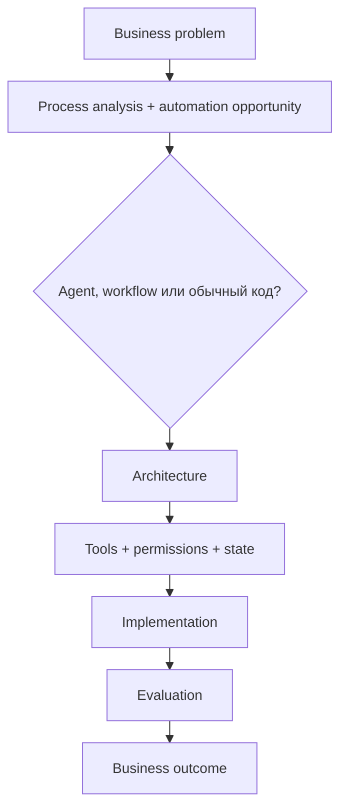
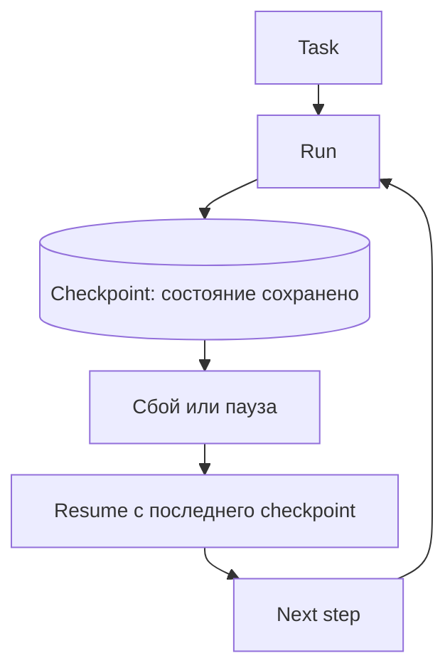

# Неделя 8. Capstone и разбор архитектуры

<div class="week-brief">
<dl>
<dt>Что уже умеем</dt>
<dd>Измерить отдельную архитектуру на учебном наборе.</dd>
<dt>Какую проблему решаем</dt>
<dd>Неясно, нужна ли автоматизация и какую пользу она дала.</dd>
<dt>Что нового появится</dt>
<dd>Business framing в `problem-definition.md` и вертикальный срез.</dd>
<dt>Что получится в конце</dt>
<dd>Capstone с отчётом outcome против ожидания.</dd>
</dl>
</div>

---

## Сначала business framing

Capstone начинается не с кода, а с короткого документа `problem-definition.md` в вашем репозитории. Он отвечает на вопрос, какую задачу вы автоматизируете и почему для неё нужен именно agent-подход. Шаблон:

```markdown
# Problem
Какую конкретную проблему решаем? Для кого и как сейчас выглядит успех?

# Current process
Как задача выполняется сегодня, какими инструментами и сколько это занимает?

# Pain point
Что именно плохо: дорого, долго, много ручной работы, много ошибок,
сложно масштабировать, постоянное переключение между системами?

# Proposed automation
Что именно автоматизируем, а что остаётся за человеком?

# Why an agent
Почему здесь нужен agent или workflow — или почему достаточно
детерминированной автоматизации: скрипта, cron, ETL, правила в CI?

# Architecture choice
Workflow или автономный агент? Один агент или несколько?
Какие tools, какой state, где нужны permissions, где human approval,
где нужен RAG, где достаточно обычного кода?

# Expected outcome
Чем измеряем результат: time saved, success rate, error rate,
доля ручных вмешательств, cost per task, latency?

# Risks
Неверное действие, выдуманный ответ, утечка данных, избыточные права,
нежелательные побочные эффекты, неконтролируемый расход.
```

Документ отвечает на вопрос, который реализация не может решить за вас: **задача вообще требует агента?** Первым полезным выводом может оказаться отрицательный:

!!! takeaway "Здесь агент вообще не нужен"
    Если процесс детерминированный — разбор issue по правилам, отчёт по расписанию, проверка соответствия шаблону, — правильное решение написать обычный код с тестами и объяснить это в `problem-definition.md`. Это хороший инженерный результат, а не неудача. Проверьте себя вопросом: **где в моей задаче нужна неоднозначность, которую нельзя заранее закодировать?** Если такого места нет, автономность добавит только стоимость, latency и новые точки отказа.

Обоснование архитектуры записывается в тот же документ, и техническое решение обязано на него ссылаться:



Заполненный `problem-definition.md` — часть артефактов сдачи. К этому моменту из предыдущих недель у вас уже есть baseline, измерения и критерии; framing просто связывает их с задачей, которую вы решаете, и позволяет сразу отказаться от агента там, где он лишний.

---

## Практика {: .course-section .course-section--practice }

Топология capstone та же, что в разделе «Архитектура курса» выше: planner → утверждение плана → read-only analyst → implementer → human approval → allowlisted tests → reviewer → отчёт. Требование недели — довести её до состояния, где каждый переход записан в trace, а лимиты вызовов конечны.

---

## Обязательные элементы и критерии завершения

Обязательный состав проекта и критерии, по которым он засчитывается, — один список: каждый пункт проверяем, иначе это пожелание.

- заполненный `problem-definition.md`, на который ссылается техническое решение, и ответ, почему выбран agent-подход, а не детерминированная автоматизация;
- один провайдер за интерфейсом `ModelClient` и конфигурация его модели;
- явные схемы handoff/state и конечные лимиты повторов;
- read-only analyst и ограниченный implementer;
- allowlist путей/команд, human approval до записи/исполнения — ни один shell command или file write не выполняется без политики и подтверждения;
- обработка invalid schema, ошибки провайдера и timeout без success-shaped fallback; недостающая информация даёт `needs_input`, а не выдуманный ответ;
- тесты happy path и хотя бы трёх отказов, trace успешного и неуспешного запуска; по каждому запуску объяснимо, почему сработал именно этот переход;
- конечный цикл ревью, минимум 5 сценариев учебного набора и README с запуском и известными ограничениями;
- отчёт, сравнивающий baseline и workflow по качеству, времени и доле ручной работы.

**Расширение:** отдельные specialist-роли, маршрутизация моделей, LangGraph, 10+ golden cases, checkpoint/resume и больше сценариев отказа.
{: .course-note .course-note--extension }

---

## Архитектурный review

В финале ответьте:

1. Какие разделения на роли дали измеримую пользу, а где оказалось достаточно одного агента?
2. Какой узел самый дорогой/медленный?
3. Какие два узла можно безопасно параллелить и на каких данных?
4. Какие общие ошибки все роли могут унаследовать?
5. Где существует риск утечки данных или чрезмерных разрешений?
6. Что заменится при переходе с локальной модели на облачную, а что должно остаться неизменным?
7. Что не следует автоматизировать даже при улучшении модели?
8. Совпал ли измеренный business outcome с ожиданием из `problem-definition.md`, и что вы изменили бы в следующей итерации?

---

## Короткие и длинные запуски агента

Короткий agent run завершается в одном ограниченном цикле. Долгий запуск упирается в другое: процесс прерывается, контекст переполняется, а сохранённые предположения устаревают. Одного `while not done: call_model()` мало — нужен **harness**, то есть внешняя обвязка, которая переживает сбой:



Checkpoint — сохранённое состояние запуска: какой узел завершён, какие артефакты существуют, что ждёт подтверждения. **Compaction** — сокращение контекста модели, чтобы освободить окно; она не заменяет checkpoint, потому что не сохраняет результат действия. **Idempotency** (идемпотентность) — свойство действия, которое можно повторить без вреда; именно она решает, допустим ли повтор после таймаута.

Поэтому для долгого запуска нужны: persistent state и checkpoints, проверяемый resume после сбоя, контролируемые compaction/reset, актуализация stale assumptions, bounded retries и явные stopping conditions. Связывайте это с human approval для значимых side effects, failure handling и trace, чтобы после восстановления было видно, что уже произошло и почему.

Подробная практика checkpoint/resume и idempotency — в неделе 12 [продвинутого трека](../autonomous-agents.md); здесь достаточно объяснить, какие элементы нужны capstone, если его запуск выходит за один процесс.

---

## Что вы действительно освоили

После основного курса вы умеете:

- определить, нужен ли для задачи агент вообще, и выбрать single-agent или multi-agent архитектуру, обосновав выбор baseline/eval;
- декомпозировать workflow на роли и проверяемые handoff-контракты;
- проектировать state/context и подключать tools через runtime;
- ограничивать permissions, применять allowlist и ставить human approval;
- задавать отказные переходы, bounded retry, escalation и конечное состояние;
- количественно оценивать задачу, регрессии, scope, стоимость и latency;
- анализировать traces и находить причину неверного перехода;
- отделять неизменную архитектуру от заменяемых моделей, провайдеров и фреймворков.

!!! rule "Rule"
    Capstone — частный случай управляемой автоматизации: те же контракты, policy, recovery и eval применяются к любому workflow с моделями и внешними инструментами.

---

## Расширения после capstone {: .course-section .course-section--extension }

Необязательно подключите LangGraph и перенесите в него тот же workflow. Сравните сложность state/checkpoint, наблюдаемость и удобство тестирования с простым Python-кодом. Не переписывайте проект на framework, если это не решает конкретную проблему.
{: .course-note .course-note--extension }

---

## Навигация

| | |
|---|---|
| ← | [Week 7: Evaluation / Trace](week-7/) |
| → | [К итоговому capstone](../) |