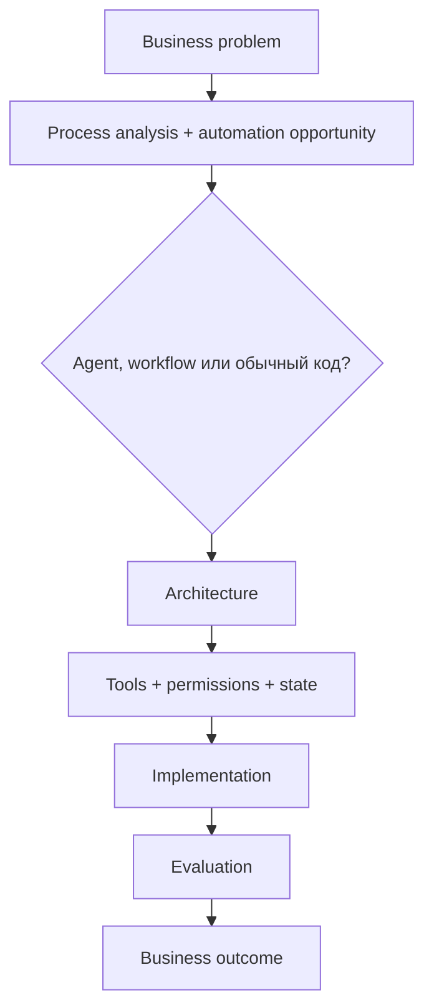
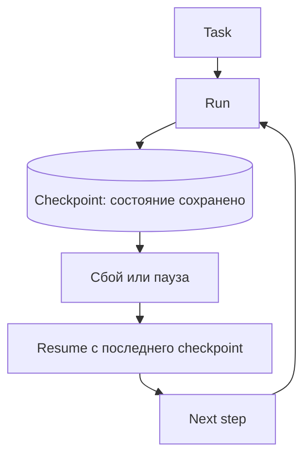
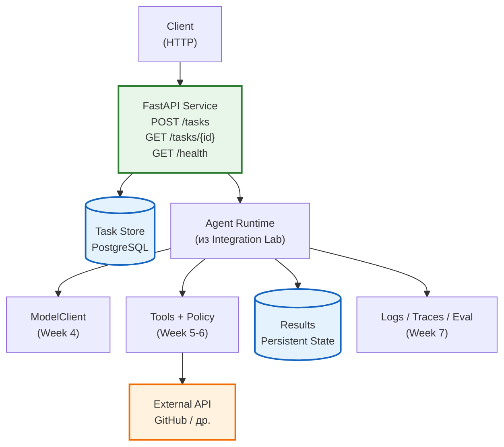

# Неделя 8. Capstone и разбор архитектуры

<div class="week-brief">
<dl>
<dt>Что уже умеем</dt>
<dd>Измерить отдельную архитектуру на учебном наборе.</dd>
<dt>Какую проблему решаем</dt>
<dd>Неясно, нужна ли автоматизация и какую пользу она дала.</dd>
<dt>Что нового появится</dt>
<dd>Business framing в `problem-definition.md`, вертикальный срез, Production Layer: API, persistent state, внешняя интеграция, async execution, Docker, observability, CI, KPI.</dd>
<dt>Что получится в конце</dt>
<dd>Capstone с отчётом outcome против ожидания + production-ready сервис.</dd>
</dl>
</div>

---

## Сначала business framing

Capstone начинается не с кода, а с короткого документа `problem-definition.md` в вашем репозитории. Он отвечает на вопрос, какую задачу вы автоматизируете и почему для неё нужен именно agent-подход. Шаблон:

```markdown
# Problem
Какую конкретную проблему решаем? Для кого и как сейчас выглядит успех?

# Current process
Как задача выполняется сегодня, какими инструментами и сколько это занимает?

# Pain point
Что именно плохо: дорого, долго, много ручной работы, много ошибок,
сложно масштабировать, постоянное переключение между системами?

# Proposed automation
Что именно автоматизируем, а что остаётся за человеком?

# Why an agent
Почему здесь нужен agent или workflow — или почему достаточно
детерминированной автоматизации: скрипта, cron, ETL, правила в CI?

# Architecture choice
Workflow или автономный агент? Один агент или несколько?
Какие tools, какой state, где нужны permissions, где human approval,
где нужен RAG, где достаточно обычного кода?

# Expected outcome
Чем измеряем результат: time saved, success rate, error rate,
доля ручных вмешательств, cost per task, latency?

# Risks
Неверное действие, выдуманный ответ, утечка данных, избыточные права,
нежелательные побочные эффекты, неконтролируемый расход.
```

Документ отвечает на вопрос, который реализация не может решить за вас: **задача вообще требует агента?** Первым полезным выводом может оказаться отрицательный:

!!! takeaway "Здесь агент вообще не нужен"
    Если процесс детерминированный — разбор issue по правилам, отчёт по расписанию, проверка соответствия шаблону, — правильное решение написать обычный код с тестами и объяснить это в `problem-definition.md`. Это хороший инженерный результат, а не неудача. Проверьте себя вопросом: **где в моей задаче нужна неоднозначность, которую нельзя заранее закодировать?** Если такого места нет, автономность добавит только стоимость, latency и новые точки отказа.

Обоснование архитектуры записывается в тот же документ, и техническое решение обязано на него ссылаться:



Заполненный `problem-definition.md` — часть артефактов сдачи. К этому моменту из предыдущих недель у вас уже есть baseline, измерения и критерии; framing просто связывает их с задачей, которую вы решаете, и позволяет сразу отказаться от агента там, где он лишний.

---

## Практика {: .course-section .course-section--practice }

Топология capstone та же, что в разделе «Архитектура курса» выше: planner → утверждение плана → read-only analyst → implementer → human approval → allowlisted tests → reviewer → отчёт. Требование недели — довести её до состояния, где каждый переход записан в trace, а лимиты вызовов конечны.

---

## Обязательные элементы и критерии завершения

Обязательный состав проекта и критерии, по которым он засчитывается, — один список: каждый пункт проверяем, иначе это пожелание.

- заполненный `problem-definition.md`, на который ссылается техническое решение, и ответ, почему выбран agent-подход, а не детерминированная автоматизация;
- один провайдер за интерфейсом `ModelClient` и конфигурация его модели;
- явные схемы handoff/state и конечные лимиты повторов;
- read-only analyst и ограниченный implementer;
- allowlist путей/команд, human approval до записи/исполнения — ни один shell command или file write не выполняется без политики и подтверждения;
- обработка invalid schema, ошибки провайдера и timeout без success-shaped fallback; недостающая информация даёт `needs_input`, а не выдуманный ответ;
- тесты happy path и хотя бы трёх отказов, trace успешного и неуспешного запуска; по каждому запуску объяснимо, почему сработал именно этот переход;
- конечный цикл ревью, минимум 5 сценариев учебного набора и README с запуском и известными ограничениями;
- отчёт, сравнивающий baseline и workflow по качеству, времени и доле ручной работы.

**Расширение:** отдельные specialist-роли, маршрутизация моделей, LangGraph, 10+ golden cases, checkpoint/resume и больше сценариев отказа.
{: .course-note .course-note--extension }

---

## Архитектурный review

В финале ответьте:

1. Какие разделения на роли дали измеримую пользу, а где оказалось достаточно одного агента?
2. Какой узел самый дорогой/медленный?
3. Какие два узла можно безопасно параллелить и на каких данных?
4. Какие общие ошибки все роли могут унаследовать?
5. Где существует риск утечки данных или чрезмерных разрешений?
6. Что заменится при переходе с локальной модели на облачную, а что должно остаться неизменным?
7. Что не следует автоматизировать даже при улучшении модели?
8. Совпал ли измеренный business outcome с ожиданием из `problem-definition.md`, и что вы изменили бы в следующей итерации?

---

## Короткие и длинные запуски агента

Короткий agent run завершается в одном ограниченном цикле. Долгий запуск упирается в другое: процесс прерывается, контекст переполняется, а сохранённые предположения устаревают. Одного `while not done: call_model()` мало — нужен **harness**, то есть внешняя обвязка, которая переживает сбой:



Checkpoint — сохранённое состояние запуска: какой узел завершён, какие артефакты существуют, что ждёт подтверждения. **Compaction** — сокращение контекста модели, чтобы освободить окно; она не заменяет checkpoint, потому что не сохраняет результат действия. **Idempotency** (идемпотентность) — свойство действия, которое можно повторить без вреда; именно она решает, допустим ли повтор после таймаута.

Поэтому для долгого запуска нужны: persistent state и checkpoints, проверяемый resume после сбоя, контролируемые compaction/reset, актуализация stale assumptions, bounded retries и явные stopping conditions. Связывайте это с human approval для значимых side effects, failure handling и trace, чтобы после восстановления было видно, что уже произошло и почему.

Подробная практика checkpoint/resume и idempotency — в неделе 12 [продвинутого трека](../autonomous-agents.md); здесь достаточно объяснить, какие элементы нужны capstone, если его запуск выходит за один процесс.

---

## Что вы действительно освоили

После основного курса вы умеете:

- определить, нужен ли для задачи агент вообще, и выбрать single-agent или multi-agent архитектуру, обосновав выбор baseline/eval;
- декомпозировать workflow на роли и проверяемые handoff-контракты;
- проектировать state/context и подключать tools через runtime;
- ограничивать permissions, применять allowlist и ставить human approval;
- задавать отказные переходы, bounded retry, escalation и конечное состояние;
- количественно оценивать задачу, регрессии, scope, стоимость и latency;
- анализировать traces и находить причину неверного перехода;
- отделять неизменную архитектуру от заменяемых моделей, провайдеров и фреймворков.

!!! rule "Rule"
    Capstone — частный случай управляемой автоматизации: те же контракты, policy, recovery и eval применяются к любому workflow с моделями и внешними инструментами.

---

## Расширения после capstone {: .course-section .course-section--extension }

Необязательно подключите LangGraph и перенесите в него тот же workflow. Сравните сложность state/checkpoint, наблюдаемость и удобство тестирования с простым Python-кодом. Не переписывайте проект на framework, если это не решает конкретную проблему.
{: .course-note .course-note--extension }

---

## Production Layer: от agent workflow к production-сервису

Capstone не заканчивается работающим agent workflow. Следующий инженерный шаг — **productionize** то, что построено: завернуть в API, сохранить состояние, подключить реальную внешнюю систему, безопасно выполнять side effects, контейнеризировать, наблюдать, тестировать и измерить бизнес-эффект.

> **Принцип:** студент не строит нового агента — он productionizes уже существующего.

### Архитектура Production Layer



---

### Этап 1 — Service Boundary: FastAPI

Минимальный production-facing API вокруг существующего `AgentRuntime`:

```text
POST /tasks           → 202 Accepted, создаёт execution, возвращает task_id
GET  /tasks/{task_id} → статус, timestamps, result, error, execution_id
GET  /health          → liveness probe
```

**`POST /tasks`** не блокирует HTTP request на всё время работы агента. Возвращает сразу:
```json
{
  "task_id": "uuid",
  "status": "queued"
}
```

**`GET /tasks/{task_id}`** возвращает:
- `status`: `queued` | `running` | `completed` | `failed` | `needs_approval`
- `created_at`, `started_at`, `completed_at`
- `result` / `error`
- `execution_id` (run_id из trace)

Цель: показать, как agent workflow становится сервисом, доступным другим системам.

---

### Этап 2 — Persistent State: PostgreSQL

Текущий `State` курса (in-memory) ≠ persistent application state.

Минимальные сущности:
| Таблица | Поля |
|---------|------|
| `tasks` | `id` (PK), `status`, `created_at`, `started_at`, `completed_at`, `payload` (JSON), `result` (JSON), `error` (text) |
| `executions` | `id` (PK), `task_id` (FK), `run_id`, `status`, `started_at`, `completed_at`, `trace` (JSONB) |

Стек: **SQLAlchemy 2.x** + **psycopg** (async). Миграции через Alembic (опционально для учебного курса — `create_all` достаточно).

---

### Этап 3 — Реальная внешняя интеграция

Используем существующий `IssueApiClient` (GitHub API) из Integration Lab. Уже реализовано:
- Authentication (Bearer token)
- Explicit tool schemas (`ToolSpec`)
- Read vs write tools (`list_issues`/`get_issue` vs `create_issue`/`close_issue`)
- Permissions через `Policy` (allowlist репозиториев, scopes)
- Error handling с маппингом HTTP кодов
- Timeout/retry с идемпотентностью
- Side effects требуют `human approval`
- Tracing через `TraceEvent`

Достаточно **одной** реальной интеграции. Не подключайте GitHub + Telegram + CRM одновременно.

---

### Этап 4 — Async / Background Execution

Production agent не выполняется внутри HTTP request:

```text
POST /tasks
      ↓
202 Accepted (task_id)
      ↓
task = queued
      ↓
BackgroundTasks / asyncio task
      ↓
task = running
      ↓
AgentRuntime.run(task)
      ↓
task = completed / failed
      ↓
Result persisted
```

Механизм: **FastAPI `BackgroundTasks`** или `asyncio.create_task()`. Не добавляйте Kafka/RabbitMQ/Celery — цель понять async execution model, а не изучить очереди.

---

### Этап 5 — Configuration и Secrets

Разделение:
```text
Code
≠
Configuration (.env, pydantic-settings)
≠
Secrets (environment variables only)
```

Покажите:
- `.env.example` с placeholder'ами
- `DATABASE_URL`, `GITHUB_TOKEN`, `MODEL_PROVIDER`, `MODEL_NAME`
- Никаких секретов в коде, промптах, коммитах, `.env.example`

Используйте **pydantic-settings** для type-safe config.

---

### Этап 6 — Docker Compose

Минимальное production-like окружение:

```yaml
# docker-compose.yml
services:
  api:
    build: .
    ports: ["8000:8000"]
    environment:
      - DATABASE_URL=postgresql+psycopg://postgres:postgres@db:5432/agent_course
      - GITHUB_TOKEN=${GITHUB_TOKEN}
    depends_on:
      db:
        condition: service_healthy
    healthcheck:
      test: ["CMD", "curl", "-f", "http://localhost:8000/health"]
      interval: 10s
      timeout: 5s
      retries: 5
  db:
    image: postgres:16-alpine
    environment:
      - POSTGRES_USER=postgres
      - POSTGRES_PASSWORD=postgres
      - POSTGRES_DB=agent_course
    ports: ["5432:5432"]
    healthcheck:
      test: ["CMD-SHELL", "pg_isready -U postgres"]
      interval: 5s
      timeout: 5s
      retries: 5
    volumes:
      - postgres_data:/var/lib/postgresql/data
volumes:
  postgres_data:
```

Студент выполняет:
```bash
docker compose up
```
и получает работающий сервис.

---

### Этап 7 — Observability

Используйте существующие материалы курса (tracing, evaluation). Production Layer показывает end-to-end trace:

```text
HTTP request
  ↓
task_id
  ↓
agent execution
  ↓
model calls
  ↓
tool calls
  ↓
external side effect (GitHub API)
  ↓
result
```

Минимальное логирование (structured JSON):
- `request_id` / `task_id`
- `execution_id` / `run_id`
- `status`
- `latency_ms`
- `tool_calls` (name, arguments_redacted, status)
- `errors`
- `model_tokens` / `cost` (если поддерживается)

Не добавляйте ELK/Grafana/Prometheus — цель: видеть, что произошло при **одном** production execution.

---

### Этап 8 — Error Handling

Production service не падает исключением. Обработайте:

| Ошибка | HTTP Status | Response |
|--------|-------------|----------|
| Invalid input (validation) | 422 | `{"detail": [...]}` |
| Task not found | 404 | `{"detail": "Task not found"}` |
| Provider failure (model) | 502 | `{"detail": "Model provider unavailable"}` |
| Timeout | 504 | `{"detail": "Execution timeout"}` |
| Tool failure (external API) | 502 | `{"detail": "External service error"}` |
| Database error | 500 | `{"detail": "Internal server error"}` |
| Permission denied | 403 | `{"detail": "Insufficient permissions"}` |

Различайте:
- **Expected business error** → 4xx, понятное сообщение, retry не поможет
- **Unexpected system failure** → 5xx, логируется, можно ретраить

---

### Этап 9 — CI

Минимальный pipeline (GitHub Actions):
```yaml
on: [push, pull_request]
jobs:
  test:
    runs-on: ubuntu-latest
    services:
      postgres:
        image: postgres:16-alpine
        env:
          POSTGRES_USER: postgres
          POSTGRES_PASSWORD: postgres
          POSTGRES_DB: agent_course
        ports: [5432:5432]
        options: --health-cmd="pg_isready -U postgres" --health-interval=5s --health-timeout=5s --health-retries=5
    steps:
      - uses: actions/checkout@v4
      - uses: actions/setup-python@v5
        with: {python-version: "3.11"}
      - run: pip install -e ".[dev]"
      - run: pytest
      - run: python -m pyright  # если настроен
  build:
    needs: test
    runs-on: ubuntu-latest
    steps:
      - uses: actions/checkout@v4
      - run: docker build -t agent-course-capstone .
```

Docker image проверяется через build. Публикация в registry — опционально.

---

### Этап 10 — Business KPI

Финальный отчёт capstone должен показывать не «сервис работает», а **«сервис улучшает бизнес-процесс»**:

```text
Baseline (ручной процесс)
  ↓
Production agent
  ↓
Quality (success rate, error rate)
  ↓
Latency (p50, p95)
  ↓
Cost ($/task, tokens/task)
  ↓
Human intervention rate (%)
  ↓
Business impact (time saved, automation rate)
```

Пример KPI report:
```markdown
## KPI Report

**Manual process:** 15 min / task

**Agent-assisted:** 4 min / task

**Automation rate:** 78%

**Human review required:** 22%

**Success rate:** 91%

**Average cost:** $0.08 / task (model tokens)

**p50 latency:** 12s
**p95 latency:** 28s
```

Цифры — реальные для учебного эксперимента или явно помечены как example.

---

## Production Checklist

В конце Week 8 студент проходит checklist:

```text
[ ] API: POST /tasks, GET /tasks/{id}, GET /health
[ ] Persistent state: PostgreSQL + SQLAlchemy
[ ] External integration: ≥1 real API (GitHub)
[ ] Permissions: allowlist + scopes + approval
[ ] Secrets: .env, pydantic-settings, no secrets in code
[ ] Async execution: BackgroundTasks / asyncio
[ ] Retries: idempotent + backoff
[ ] Structured logs: JSON, request_id, trace correlation
[ ] Tracing: end-to-end execution trace
[ ] Evaluation: quality + cost + latency metrics
[ ] Docker: docker-compose up works
[ ] CI: pytest + lint + typecheck + docker build
[ ] KPI: baseline vs agent report
```

Это не новые концепции — итоговый checklist всего курса.

---

## Что вы действительно освоили (updated)

После основного курса + Production Layer вы умеете:

- определить, нужен ли для задачи агент вообще, и выбрать single-agent или multi-agent архитектуру, обосновав выбор baseline/eval;
- декомпозировать workflow на роли и проверяемые handoff-контракты;
- проектировать state/context и подключать tools через runtime;
- ограничивать permissions, применять allowlist и ставить human approval;
- задавать отказные переходы, bounded retry, escalation и конечное состояние;
- количественно оценивать задачу, регрессии, scope, стоимость и latency;
- анализировать traces и находить причину неверного перехода;
- отделять неизменную архитектуру от заменяемых моделей, провайдеров и фреймворков.
- **завернуть agent workflow в production API (FastAPI)**
- **сохранять состояние в PostgreSQL через SQLAlchemy**
- **подключать реальную внешнюю систему с auth, permissions, retries**
- **запускать agent асинхронно вне HTTP request**
- **управлять конфигурацией и секретами через environment variables**
- **контейнеризировать сервис через Docker Compose**
- **наблюдать за execution через structured logs и traces**
- **настроить минимальный CI pipeline**
- **измерить бизнес-эффект через KPI report**

---

## Расширения после capstone {: .course-section .course-section--extension }

Необязательно подключите LangGraph и перенесите в него тот же workflow. Сравните сложность state/checkpoint, наблюдаемость и удобство тестирования с простым Python-кодом. Не переписывайте проект на framework, если это не решает конкретную проблему.
{: .course-note .course-note--extension }

---

## Навигация

| | |
|---|---|
| ← | [Week 7: Evaluation / Trace](week-7/) |
| → | [К итоговому capstone](../) |