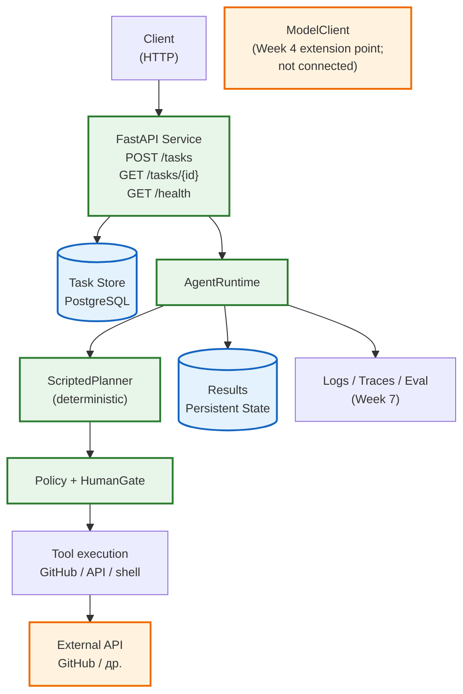
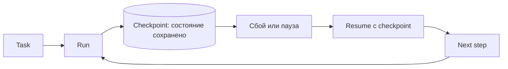

# Неделя 9. Productionize the Capstone

<div class="week-brief">
<dl>
<dt>Что уже умеем</dt>
<dd>Спроектировать автоматизацию и обосновать архитектуру Capstone.</dd>
<dt>Какую проблему решаем</dt>
<dd>Рабочий workflow ещё не доступен другим системам и не сохраняет состояние между HTTP-запросами.</dd>
<dt>Что нового появится</dt>
<dd>Production Layer для существующего Capstone: API, persistent state, внешняя интеграция, async execution, Docker, observability, CI и KPI.</dd>
<dt>Что получится в конце</dt>
<dd>Production-like сервис, связанный с измеримым outcome из solution design Week 8.</dd>
</dl>
</div>

> 🧭 **Где мы:** LLM → Context / State → Tools → **[Runtime / Orchestration]** → Policy / Permissions → Evaluation / Observability.

---

!!! note "Продолжаем тот же Capstone"
    У нас уже есть спроектированный и оценённый Capstone. Теперь превращаем его в production-like сервис: добавляем границу API, persistence, безопасную интеграцию, эксплуатационную проверку и сопоставляем результат с бизнес-целями из Week 8.

### Вспомни прошлую неделю

1. Какой основной выбор Week 8 фиксирует границу автоматизации для Capstone?
2. Где в предыдущем workflow уже есть `State`, `RunPolicy` и `HumanGate`?

## Core vs Extension

**Core:** productionize the same Capstone, not build a new agent from scratch. Для зачёта важно показать, как `Workflow` из прошлых недель становится service boundary: API, persistent state, side effects through tool policy, async execution, observability. 

**Extension:** конкретные SDK/provider details, optional async framework tuning, advanced deployment patterns, extra monitoring and queue tools. Это полезно, но не является обязательным для понимания Week 9.

> **Главный смысл:** runtime и business workflow уже известны; Week 9 показывает, как их безопасно вынести в работающий production-like сервис.

## Production Layer: от agent workflow к production-сервису

Capstone не заканчивается работающим agent workflow. Следующий инженерный шаг — **productionize** то, что построено: завернуть в API, сохранить состояние, подключить реальную внешнюю систему, безопасно выполнять side effects, контейнеризировать, наблюдать, тестировать и измерить бизнес-эффект.

> **Принцип:** студент не строит нового агента — он productionizes уже существующего.

### Архитектура Production Layer



Production Layer uses deterministic `ScriptedPlanner`; `ModelClient` remains an extension point introduced in Week 4 and is not connected to this runtime.

---

### Этап 1 — Service Boundary: FastAPI

Минимальный production-facing API вокруг существующего `AgentRuntime`:

```text
POST /tasks           → 202 Accepted, создаёт execution, возвращает task_id
GET  /tasks/{task_id} → статус, timestamps, result, error, execution_id
GET  /health          → liveness probe
```

**`POST /tasks`** не блокирует HTTP request на всё время работы агента. Возвращает сразу:
```json
{
  "task_id": "uuid",
  "status": "queued"
}
```

**`GET /tasks/{task_id}`** возвращает:
- `status`: `queued` | `running` | `completed` | `failed` | `needs_approval` | `blocked`
- `created_at`, `started_at`, `completed_at`
- `result` / `error`
- `execution_id` (run_id из trace)

**Контракт статусов:**

| Статус | Значение | `completed_at` |
|---|---|---|
| `queued` | Задача создана, выполнение не началось | `null` |
| `running` | Выполняется в background | `null` |
| `completed` | Успешно завершено | установлено |
| `failed` | Ошибка выполнения | установлено |
| `needs_approval` | Сохранённый non-terminal snapshot остановленного execution на HumanGate | `null` |
| `blocked` | Действие отклонено до исполнения: policy, неизвестный tool, repository вне allowlist, недостающий scope, invalid arguments или отклонённое human approval | установлено |

`blocked` отличается от `failed`:
- `failed` — системная ошибка после старта выполнения, например исключение, timeout, provider unavailable или исчерпание retry budget;
- `blocked` — политика отклонила действие до исполнения, причина в `error`/`trace`.

`blocked` и `failed` — terminal-статусы и фиксируют `completed_at`. `needs_approval` — non-terminal persisted snapshot остановленного execution на HumanGate; `completed_at = null`. Текущий сервис не предоставляет resume endpoint, поэтому это не полноценное возобновляемое состояние очереди, не success и не completed execution.

> **Важно:** после исчерпания retry budget для безопасной операции execution заканчивается как `failed`, а не как `blocked`. `blocked` означает «действие не было разрешено до исполнения».

Цель: показать, как agent workflow становится сервисом, доступным другим системам.

---

### Этап 2 — Persistent State: PostgreSQL

Текущий `State` курса (in-memory) ≠ persistent application state.

Минимальные сущности:
| Таблица | Поля |
|---------|------|
| `tasks` | `id` (PK), `status`, `created_at`, `started_at`, `completed_at`, `payload` (JSON), `result` (JSON), `error` (text) |
| `executions` | `id` (PK), `task_id` (FK), `run_id`, `status`, `started_at`, `completed_at`, `trace` (JSONB) |

Стек: **SQLAlchemy 2.x** + **psycopg** (async). Миграции через Alembic (опционально для учебного курса — `create_all` достаточно).

#### Короткие и длинные запуски агента

Короткий agent run завершается в одном ограниченном цикле. Долгий запуск может прерваться, исчерпать контекст или продолжиться с устаревшими предположениями. Одного `while not done: call_model()` недостаточно — нужен внешний **harness** (обвязка), которая сохраняет прогресс:



Checkpoint хранит, какой узел завершён, какие артефакты существуют и что ждёт подтверждения. **Compaction** сокращает контекст модели, но не сохраняет результат действия и не заменяет checkpoint. **Idempotency** — свойство действия, которое можно повторить без вреда; она определяет, допустим ли повтор после таймаута.

Для долгого запуска нужны persistent state, проверяемое восстановление, обновление устаревших предположений, bounded retries и условия остановки. Свяжите восстановление с human approval для значимых side effects и trace: после сбоя должно быть понятно, что уже произошло и почему. Подробная практика checkpoint/resume и idempotency остаётся расширением в [треке автономных агентов](../autonomous-agents.md).

---

### Этап 3 — Реальная внешняя интеграция

!!! question "🤔 Predict"
  Внешний API получил запрос на запись, но соединение оборвалось до ответа. Можно ли безопасно повторить такой запрос автоматически, если неизвестно, применилось ли первое действие?

Используем существующий `IssueApiClient` (GitHub API) из Integration Lab. Уже реализовано:
- Authentication (Bearer token)
- Explicit tool schemas (`ToolSpec`)
- Read vs write tools (`list_issues`/`get_issue` vs `create_issue`/`close_issue`)
- Permissions через `Policy` (allowlist репозиториев, scopes)
- Error handling с маппингом HTTP кодов
- Timeout/retry с идемпотентностью
- Side effects требуют `human approval`
- Tracing через `TraceEvent`

Достаточно **одной** реальной интеграции. Не подключайте GitHub + Telegram + CRM одновременно.

---

### Этап 4 — Async / Background Execution

Production agent не выполняется внутри HTTP request:

```text
POST /tasks
      ↓
202 Accepted (task_id)
      ↓
task = queued
      ↓
BackgroundTasks / asyncio task
      ↓
task = running
      ↓
AgentRuntime.run(task)
      ↓
task = completed / failed
      ↓
Result persisted
```

Механизм: **FastAPI `BackgroundTasks`** или `asyncio.create_task()`. Не добавляйте Kafka/RabbitMQ/Celery — цель понять async execution model, а не изучать очереди.

!!! warning "Ограничение BackgroundTasks"
    Production Layer использует **FastAPI `BackgroundTasks`** — это process-local execution.

    - `restart/crash` процесса не является durable queue
    - queued/running jobs не имеют automatic recovery
    - для production deployment используйте Celery/RabbitMQ/Kafka

**Async execution details (#3):**

`execute_agent_task` — async function, но `runtime.run()` вызывает `IssueApiClient`, который использует blocking `urllib.request.urlopen()`. Blocking I/O выносится в thread через `asyncio.to_thread`, чтобы event loop оставался responsive. Если retry budget исчерпан после повторов безопасного чтения и результат всё ещё не получен, выполнение сохраняется как `failed` и не маскируется под `blocked`:

```python
# runtime.run() → IssueApiClient → urllib.request.urlopen() is blocking I/O.
report = await asyncio.to_thread(runtime.run, task_description)
```

Это минимальное изменение: не требует async HTTP framework, не меняет архитектуру `IssueApiClient`. Альтернатива — полный переход на `httpx.AsyncClient`, но она увеличивает scope без необходимости для учебного курса.

**Тесты и sleep (#15):**

Интеграционные тесты используют deterministic polling вместо фиксированных `sleep()`:

```python
# Хорошо: polling с timeout
deadline = time.monotonic() + timeout
while time.monotonic() < deadline:
    if condition:
        return result
    await asyncio.sleep(poll_interval)

# Плохо: фиксированный sleep
await asyncio.sleep(2)  # flaky
```

`IssueApiClient` использует `time.sleep()` только внутри exponential backoff между retry — это не тест, а часть production logic.

---

### Этап 5 — Configuration и Secrets

Разделение:
```text
Code
≠
Configuration (.env, pydantic-settings)
≠
Secrets (environment variables only)
```

Покажите:
- `.env.example` с placeholder'ами
- `DATABASE_URL`, `GITHUB_TOKEN`
- Никаких секретов в коде, промптах, коммитах, `.env.example`

**Безопасность GitHub credentials (#10):**

Рекомендуется **fine-grained personal access token** (не classic PAT):

```text
one token
  → one repository
  → minimum required permissions
```

Минимальные permissions для Production Layer (Issues API):
- **Issues** — read + write (list, get, create, close)
- **Metadata** — read (требуется GitHub API)
- **Contents** — не требуется (этот flow работает только через Issues)

Classic PAT со scope `repo` не рекомендуется — он даёт доступ ко всем репозиториям, к которым у токена есть доступ. Для учебного курса достаточно одного репозитория с минимальными permissions.

Используйте `.env` (в `.gitignore`) и environment variables — никаких токенов в коде, коммитах или `.env.example`.

Используйте **pydantic-settings** для type-safe config.

---

### Этап 6 — Docker Compose

Минимальное production-like окружение:

```yaml
# docker-compose.yml
services:
  api:
    build: .
    ports: ["8000:8000"]
    environment:
      - DATABASE_URL=postgresql+psycopg://postgres:postgres@db:5432/agent_course
      - GITHUB_TOKEN=${GITHUB_TOKEN}
    depends_on:
      db:
        condition: service_healthy
    healthcheck:
      test: ["CMD", "curl", "-f", "http://localhost:8000/health"]
      interval: 10s
      timeout: 5s
      retries: 5
  db:
    image: postgres:16-alpine
    environment:
      - POSTGRES_USER=postgres
      - POSTGRES_PASSWORD=postgres
      - POSTGRES_DB=agent_course
    ports: ["5432:5432"]
    healthcheck:
      test: ["CMD-SHELL", "pg_isready -U postgres"]
      interval: 5s
      timeout: 5s
      retries: 5
    volumes:
      - postgres_data:/var/lib/postgresql/data
volumes:
  postgres_data:
```

Команда одинакова в Windows PowerShell, macOS Terminal и Linux shell; её выполняют из каталога с compose-файлом:

```text
docker compose up
```
и получает работающий сервис.

---

### Этап 7 — Observability

Используйте существующие материалы курса (tracing, evaluation). Production Layer показывает end-to-end trace:

```text
HTTP request
  ↓
  task_id
  ↓
agent execution
  ↓
tool calls
  ↓
external side effect (GitHub API)
  ↓
result
```

Минимальное логирование (structured JSON):

| Поле | Что это | Где хранится |
|---|---|---|
| `task_id` | UUID задачи (PK Task) | Task, Execution, логи |
| `run_id` | Идентификатор agent run (`run-{uuid}`) | Execution.run_id, TraceEvent |
| `execution_id` | В API = `run_id` (совпадает с Week 9) | GET /tasks/{id} |
| `status` | queued / running / completed / failed / needs_approval / blocked | Task, Execution |
| `latency_ms` | Время выполнения | логи |
| `tool_calls` | Имя, аргументы (redacted), статус | TraceEvent, Execution.trace |
| `errors` | Текст ошибки и тип | Task.error, Execution.trace |
| `request_id` | Генерируется middleware для каждого HTTP request; привязан к structlog context. Не сохраняется в БД. | логи |

`request_id` и `run_id` коррелируют: один HTTP request → один `request_id`; один background execution → один `run_id`. Для корреляции request → task используйте `task_id` в логах.

Не добавляйте ELK/Grafana/Prometheus — цель: видеть, что произошло при **одном** production execution.

---

### Этап 8 — Error Handling

Production service не падает исключением. Ошибки делятся на два уровня:

**Синхронные ошибки** — возвращаются непосредственно в ответ на HTTP request:

| Ошибка | HTTP Status | Response |
|--------|-------------|----------|
| Invalid input (validation) | 422 | `{"detail": [...]}` |
| Task not found | 404 | `{"detail": "Task not found"}` |
| Permission denied | 403 | `{"detail": "Insufficient permissions"}` |
| Database error | 500 | `{"detail": "Internal server error"}` |

**Ошибки в background execution** — не становятся HTTP-статусом исходного POST. POST `/tasks` всегда возвращает `202 Accepted`. Ошибка сохраняется в Task/Execution, и `GET /tasks/{task_id}` возвращает её в поле `error`:

| Ошибка | Где видна |
|--------|-----------|
| Provider failure (model) | `GET /tasks/{id}` → `error` |
| Timeout | `GET /tasks/{id}` → `error` |
| Tool failure (external API) | `GET /tasks/{id}` → `error` |
| Agent execution error | `GET /tasks/{id}` → `error`, `status=failed` |

```text
POST /tasks
  → 202 Accepted (task_id, status=queued)

background execution
  → error persisted in Task/Execution

GET /tasks/{task_id}
  → current status + error
```

Различайте:
- **Expected business error** → 4xx, понятное сообщение, retry не поможет
- **Unexpected system failure** → 5xx, логируется, можно ретраить

---

### Этап 9 — CI

Минимальный pipeline (GitHub Actions):
```yaml
on: [push, pull_request]
jobs:
  test:
    runs-on: ubuntu-latest
    services:
      postgres:
        image: postgres:16-alpine
        env:
          POSTGRES_USER: postgres
          POSTGRES_PASSWORD: postgres
          POSTGRES_DB: agent_course
        ports: [5432:5432]
        options: --health-cmd="pg_isready -U postgres" --health-interval=5s --health-timeout=5s --health-retries=5
    steps:
      - uses: actions/checkout@v4
      - uses: actions/setup-python@v5
        with: {python-version: "3.11"}
      - run: pip install -e ".[dev]"
      - run: pytest
      - run: python -m pyright  # если настроен
  build:
    needs: test
    runs-on: ubuntu-latest
    steps:
      - uses: actions/checkout@v4
      - run: docker build -t agent-course-capstone .
```

Docker image проверяется через build. Публикация в registry — опционально.

---

### Этап 10 — Business KPI

Финальный отчёт capstone должен показывать не «сервис работает», а **«сервис улучшает бизнес-процесс»**:

```text
Baseline (ручной процесс)
  ↓
Production agent
  ↓
Quality (success rate, error rate)
  ↓
Latency (p50, p95)
  ↓
Cost ($/task, tokens/task)
  ↓
Human intervention rate (%)
  ↓
Business impact (time saved, automation rate)
```

Пример KPI report:
```markdown
## KPI Report

**Manual process:** 15 min / task

**Agent-assisted:** 4 min / task

**Automation rate:** 78%

**Human review required:** 22%

**Success rate:** 91%

**Average cost:** $0.08 / task (model tokens)

**p50 latency:** 12s
**p95 latency:** 28s
```

Цифры — реальные для учебного эксперимента или явно помечены как example.

---

## Production Checklist

В конце Week 9 студент проходит checklist. Это **production-oriented educational service** — не production-ready система.

```text
[ ] API: POST /tasks, GET /tasks/{id}, GET /health
[ ] Persistent state: PostgreSQL + SQLAlchemy
[ ] External integration: ≥1 real API (GitHub)
[ ] Permissions: allowlist + scopes + approval
[ ] Secrets: .env, pydantic-settings, no secrets in code
[ ] Async execution: BackgroundTasks / asyncio
[ ] Retries: exponential backoff (idempotent reads), no automatic retry for writes
[ ] Structured logs: JSON, task_id, run_id, execution_id, trace correlation
[ ] Tracing: end-to-end execution trace
[ ] Evaluation: quality + cost + latency metrics
[ ] Docker: docker-compose up works
[ ] CI: pytest + lint + typecheck + docker build
[ ] KPI: baseline vs agent report
```

**Режимы работы:**

| Режим | RUNNER_MODE | External API | Side effects |
|---|---|---|---|
| Test / CI | `test` | none | none |
| Demo | `demo` | mock or real (opt-in) | deterministic ToolCall, `DEMO_APPROVE_WRITES` |
| Real integration | `demo` + real token | real GitHub | explicit opt-in required |

**Демонстрация:**

Команда ниже одинакова в Windows PowerShell, macOS и Linux и выполняется из корня репозитория:

```text
docker compose -f labs/integration-lab/docker-compose.yml up --build
```

Текущий Compose-файл запускает безопасный `RUNNER_MODE=test`; shell-переменная перед командой Compose не включает demo. Кроссплатформенная инструкция для локального demo с явной настройкой `.env` и opt-in записи приведена в Production README лаборатории Integration Lab в исходном репозитории; описание лаборатории на сайте — [Integration Lab](../integration-lab.md).

Это не новые концепции — итоговый checklist всего курса.

---

## Retry / backoff (#8)

Production Layer использует **exponential backoff с jitter** в `IssueApiClient`:

```text
backoff(attempt) = min(backoff_base × 2^(attempt-1), backoff_max)
jittered = backoff × uniform(0.5, 1.0)
```

Для `DEFAULT_MAX_RETRIES=3`: задержки ~0.25–0.5s, 0.5–1s, 1–2s (каприруются на `backoff_max=4s`).

Jitter предотвращает синхронные повторы при rate limit — несколько клиентов не бьют в API одновременно. Ограничен: тесты проверяют диапазон, а не конкретное значение.

**Явно разделены retryable и non-retryable ошибки:**

| Ошибка | Retryable? | Поведение |
|---|---|---|
| `5xx` на чтении (GET) | Да | Повтор с backoff в пределах бюджета, затем `failed` |
| Connection reset на чтении | Да | Повтор с backoff |
| `5xx` на записи (POST/PATCH) | Нет | `WriteOutcomeUnknownError` — эффект мог примениться, повтор не выполняется автоматически |
| Connection lost на записи | Нет | `WriteOutcomeUnknownError` — повтор не выполняется |
| Timeout на чтении | Да | Повтор с backoff, затем `TransportTimeoutError` и `failed` |
| Timeout на записи | Нет | `WriteOutcomeUnknownError` — запрос отправлен, эффект мог примениться |
| `401` / `403` | Нет | `AuthenticationError` / `PermissionDeniedError` — тихих повторов нет |
| `404` | Нет | `NotFoundError` |
| `400` / `409` / `413` / `422` | Нет | `ValidationRejectedError` |

**Правило:** повторы разрешены только для **идемпотентных чтений** (GET). Записи (POST/PATCH/DELETE) не повторяются автоматически — это защищает от дубликатов.

---

## Практика {: .course-section .course-section--practice }

Возьмите solution design из Week 8 и проверьте его как сервис:

1. Запустите `RUNNER_MODE=test` и проверьте `/health` без GitHub token.
2. Создайте задачу через `POST /tasks`; получите её состояние через `GET /tasks/{task_id}`.
3. Проследите `task_id`, `execution_id`, status, timestamps и trace до результата.
4. Запустите deterministic demo на локальном mock API и проверьте policy, approval и side effect.
5. Заполните measured значения KPI и сравните их с baseline и target из Week 8.

Не включайте реальный GitHub token для smoke test и не выполняйте demo-запись в реальном репозитории без явного разрешения.

!!! success "🎉 What you can do now"
    Вы можете предоставить существующий workflow как наблюдаемый сервис, сохранив policy и human approval на внешних действиях.

---

## Результат недели {: .course-section .course-section--result }

- тот же Capstone доступен через API и сохраняет lifecycle в persistent state;
- внешнее действие проходит через tools, policy и human approval;
- Docker smoke и CI проверяют сервис, а trace объясняет выполнение;
- measured KPI сопоставлены с целями solution design Week 8.

> **Итог Week 9:** выбранное решение поставлено как проверяемый production-like сервис; архитектура остаётся той, что была обоснована в Week 8.

### Проверь себя

1. Чем `blocked` отличается от `failed` в production execution?
2. Почему текущий Production Layer работает с `ScriptedPlanner`, а `ModelClient` остаётся неподключённой extension point?
3. Какой outcome из Week 8 должен стать измеримым KPI в Week 9?

---

## Резюме: Productionize Capstone

Capstone — не новый проект, а **production-ization** уже спроектированной системы. Week 9 фокусируется на поставке solution design из Week 8 как сервиса:

| Фокус Week 9 | Уже освоено раньше |
|---|---|
| **Service boundary** — API, async execution | Workflow, handoff, runtime — Weeks 2, 5 |
| **Persistence** — PostgreSQL, SQLAlchemy | State, context — Week 3, 5 |
| **Packaging** — Docker, Docker Compose, CI | Mock provider, tests — Weeks 4, 7 |
| **Observability** — structured logs, traces, KPI | Trace, eval, метрики — Week 7 |
| **KPI report** — measured business impact | Baseline, comparison — Weeks 1, 7, 8 |

Обоснование solution design уже оформлено в Week 8. Здесь мы реализуем выбранную границу автоматизации, проверяем эксплуатационный путь и сравниваем измеренный outcome с целями.

---

## Итог курса

После основного курса вы умеете:

- определить, нужен ли для задачи агент вообще, и выбрать single-agent или multi-agent архитектуру, обосновав выбор baseline/eval;
- декомпозировать workflow на роли и проверяемые handoff-контракты;
- проектировать state/context и подключать tools через runtime;
- ограничивать permissions, применять allowlist и ставить human approval;
- задавать отказные переходы, bounded retry, escalation и конечное состояние;
- количественно оценивать задачу, регрессии, scope, стоимость и latency;
- анализировать traces и находить причину неверного перехода;
- отделять неизменную архитектуру от заменяемых моделей, провайдеров и фреймворков;
- завернуть agent workflow в production API (FastAPI);
- сохранять состояние в PostgreSQL через SQLAlchemy;
- подключать внешнюю систему с auth, permissions и retries;
- запускать agent асинхронно вне HTTP request;
- управлять конфигурацией и секретами через environment variables;
- контейнеризировать сервис через Docker Compose;
- наблюдать за execution через structured logs и traces;
- настроить единый CI pipeline;
- измерить бизнес-эффект через KPI report.

## ✅ Definition of Done

- Объяснить, как API, persistence и background execution оборачивают прежний Capstone workflow, не заменяя его новой архитектурой.
- Проследить задачу через API, persistent status, execution trace и результат.
- Запустить проверки сервиса на mock/deterministic режиме и подтвердить, что запрещённое действие не исполняется.
- Различить `blocked`, `failed` и `needs_approval`; не повторять неоднозначную запись без гарантии идемпотентности.
- Сопоставить измеренный KPI с baseline и target из Week 8 и назвать эксплуатационный риск.

---

## Навигация

| | |
|---|---|
| ← | [Week 8: Business Automation & Solution Design](week-8/) |
| → | [К итоговому Capstone](../) |
