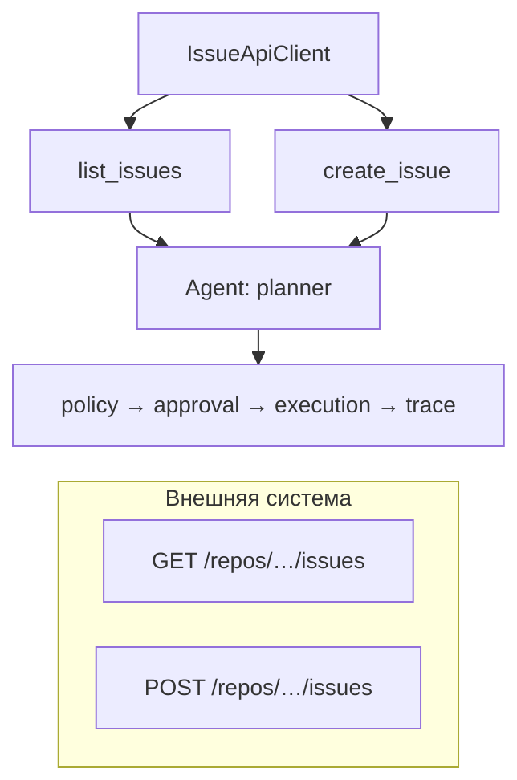
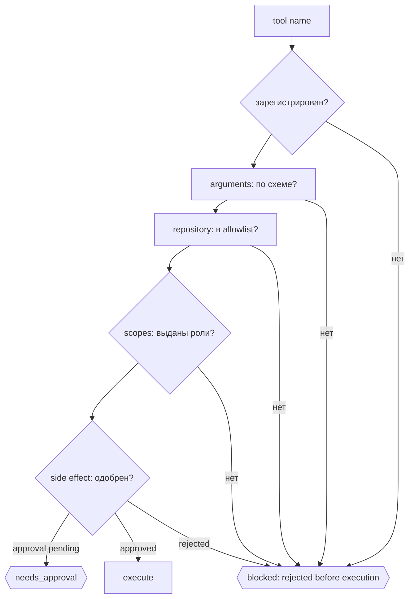

# Integration Lab: агент и внешняя система

До этого агент работал только на чтение: инструмент возвращал информацию, и ошибка стоила лишнего вызова модели. Здесь характер инструмента меняется — **tool может изменить внешний мир**. Всё остальное в лаборатории следует из этого одного факта: чтение можно повторить, запись — нет.

| Что меняется | Что из этого следует |
|---|---|
| Запись создаёт данные, которые видит другой человек | read и write — разные инструменты с разными правами |
| У роли не может быть прав больше, чем нужно её задаче | **scope** (набор разрешённых операций) и **least privilege** |
| Правило «здесь можно» должно исполняться кодом, а не текстом | **policy** отклоняет вызов до исполнения |
| Часть записей необратима для процесса | **human approval** перед записью |
| Внешний сервис может упасть или ответить таймаутом | **retry** только для чтения, **trace** на каждый отказ |

Внешняя система намеренно простая и локальная: небольшой REST-сервис issue поверх SQLite, повторяющий форму GitHub Issues — те же маршруты, bearer-токен, JSON и коды ошибок. Поэтому курс остаётся Python-first и запускается без аккаунта и сети. Предметная область не выдумана — это тот же сценарий разбора issue, что и в остальном курсе.

## Два пути



Первый путь — чтение. Второй важен больше: предложенное агентом действие с побочным эффектом не доходит до внешней системы, пока это не разрешил policy и не подтвердил человек.

Цепочка проверок ниже — это ровно та же цепочка, что в неделе 6: агент предлагает вызов → tool проверяется по имени и аргументам → policy решает, разрешено ли → права роли сверяются с `scopes` → опасное действие ждёт approval. Разница в том, что здесь «policy» и «permission» обеспечивает не ваш код, а внешний сервис: у токена собственные `scopes`, у API собственные коды ошибок, а проверка «путь в allowlist» из недели 6 превращается в проверку «репозиторий в allowlist».

## Что реализовано

### Windows PowerShell

Из корня репозитория установите зависимости, выполните тесты и запустите сценарии:

```powershell
.\.venv\Scripts\python.exe -m pip install -e ".\labs\integration-lab[dev]"
.\.venv\Scripts\python.exe -m pytest .\labs\integration-lab\tests
.\.venv\Scripts\python.exe -m integration_lab --scenario read
.\.venv\Scripts\python.exe -m integration_lab --scenario write-denied
.\.venv\Scripts\python.exe -m integration_lab --scenario write-approved --approve-writes
.\.venv\Scripts\python.exe -m integration_lab --scenario delete
```

### macOS / Linux

Из корня репозитория выполните те же команды с POSIX-путями:

```bash
./.venv/bin/python -m pip install -e "./labs/integration-lab[dev]"
./.venv/bin/python -m pytest ./labs/integration-lab/tests
./.venv/bin/python -m integration_lab --scenario read
./.venv/bin/python -m integration_lab --scenario write-denied
./.venv/bin/python -m integration_lab --scenario write-approved --approve-writes
./.venv/bin/python -m integration_lab --scenario delete
```

Создайте `.venv` по инструкции в разделе [учебные репозитории курса](lab-repository.md), если окружение ещё не настроено. Тесты должны пройти; каждый сценарий локально запускает временный API и печатает отчёт в терминал.

| Слой | Ключевые решения |
|---|---|
| Внешняя система | HTTP + SQLite, bearer-токены со scopes, предсказуемые ошибки вида `{"error": {"code", "message"}}` |
| Адаптер | Типизированные методы, валидация аргументов до запроса, таймаут, ограниченный retry только для повторов без вреда (идемпотентных чтений) |
| Инструменты | Узкие схемы, у каждого инструмента `required_scopes` и признак `side_effect` |
| Runtime | Реестр, allowlist репозиториев, проверка scopes, human gate, redaction, trace |

## Least privilege, а не только prompt

API реализует `DELETE /repos/{owner}/{repository}`. Агент не может его вызвать: ни один инструмент этот маршрут не оборачивает, поэтому попытка отклоняется как `tool_not_registered` до любого HTTP-запроса. Ограничение живёт в коде реестра, а не в тексте инструкции.

Проверки выполняются в строгом порядке, и каждая оставляет след в trace:



Отказ никогда не превращается в успешный результат: отчёт получает `blocked` при policy rejection до исполнения или отклонённом approval, `failed` при ошибке уже начавшегося tool execution либо `needs_approval`, пока решение HumanGate ожидается. Одобрение человека выдаётся отдельным флагом `--approve-writes`.

Переход на настоящий GitHub меняет базовый URL и токен, но не инструменты, policy и тесты; заодно становится видимым, что придётся дописать: rate limits и `Retry-After`, пагинация, `Idempotency-Key` для повторов записи и условные запросы.

## Отказы внешней системы

| Ситуация | Поведение |
|---|---|
| `401` / `403` | типизированные исключения, никаких тихих повторов и подмены токена |
| `404` | `NotFoundError`, а не пустой успешный список |
| `5xx` на чтении | один повтор в пределах бюджета, затем `failed` |
| таймаут на чтении | `TransportTimeoutError`; после начала запроса и исчерпания retry run завершается как `failed` |
| таймаут на записи | `WriteOutcomeUnknownError`: запрос отправлен, эффект мог примениться; run завершается как `failed`, повтор не выполняется автоматически |

Отказ по `401`/`403` также завершает уже начатый вызов как `failed`; `blocked` зарезервирован для отказа policy до вызова внешнего API. Если человек отклоняет запрос на side effect до исполнения, итоговый статус — `blocked`; пока решение ожидается, используется `needs_approval`.

!!! caution "Таймаут на записи"

    Последний случай — самая частая ошибка интеграций. Тест в лаборатории показывает, что эффект действительно приходит после таймаута, а наивный повтор создаёт дубликат. Это принцип модуля 4 «Recovery» [продвинутого трека](autonomous-agents.md): перед повтором действия с эффектом сверяйте его результат, а если API это поддерживает, используйте idempotency key.

## Границы

Лаборатория полностью локальная: сервер слушает только `127.0.0.1` и поднимается на время запуска, API-ключи и внешние зависимости не нужны. Не указывайте в `--database` рабочие базы. Токены здесь — учебные строки в конфигурации процесса; в реальной системе токен берётся из окружения, не попадает в prompt и в trace.

Команды запуска, список сценариев и практические задания описаны в `labs/integration-lab/README.md` исходного репозитория.
