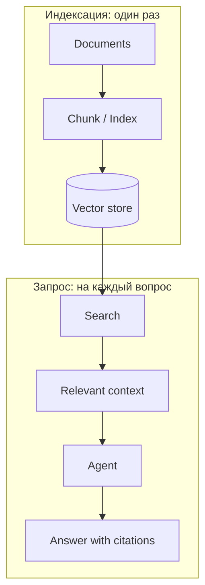

# RAG-лаборатория: retrieval как инструмент агента

RAG Lab — компактная лаборатория курса, где retrieval показан как компонент агентной системы, а не как отдельная дисциплина. Задача лаборатории не «объяснить технологию embeddings», а показать, как найденный контекст становится частью tool/context layer и что происходит, когда релевантной информации нет.

Логика лаборатории вытекает из одного ограничения: модель не знает содержимое корпуса, а передать весь корпус целиком нельзя — он не поместится в контекст и затеряет релевантное в шуме. Значит, ищем только те фрагменты, которые нужны текущему вопросу, и передаём их вместе с источником. Это и есть retrieval; RAG (Retrieval-Augmented Generation, генерация с извлечением) — ответ модели по найденному фрагменту.

!!! why "Why it matters"

    Ошибка здесь тихая: если релевантного фрагмента не нашлось, модель отвечает «из своей памяти» — уверенно и неправильно. Лаборатория делает этот отказ измеримым вместо того, чтобы надеяться на аккуратность промпта.

## Архитектура

Индексация корпуса и запрос — два разных прохода:



Агент не получает корпус целиком. Он сам решает, что ему не хватает фактов, вызывает поиск, получает ссылки с оценками и короткими сниппетами и загружает полный текст только тех фрагментов, которые нужны текущему вопросу. Это тот же Just-in-Time Context из недели 3, реализованный кодом.

## Что реализовано

```powershell
.\.venv\Scripts\python.exe -m pip install -e ".\labs\rag-lab[dev]"
.\.venv\Scripts\python.exe -m rag_lab --corpus .\labs\rag-lab\corpus --cases .\labs\rag-lab\questions.json
```

| Шаг | Что видно в коде |
|---|---|
| Ingestion и chunking | Разбиение Markdown по секциям и скользящему окну; у каждого фрагмента есть документ, секция и идентификатор. |
| Embeddings | Детерминированный локальный embedder без внешних пакетов и API. |
| Vector store и поиск | In-memory индекс, cosine similarity, порог отсечения, top-k. |
| Retrieval tool | Два узких инструмента с явной схемой аргументов; неизвестное имя и неверный тип отклоняются до исполнения. |
| Агент и ответ | Цикл поиск → чтение → ответ, отказ при отсутствии опоры в контексте, trace каждого шага. |
| Оценка | Три метрики недели 7, применённые к retrieval. |

## Когда отвечать нельзя

В `questions.json` есть два негативных случая. Один вопрос вообще не про этот корпус, другой частично совпадает по словам, но ответа не содержит. В обоих случаях агент возвращает `insufficient_context`: поиск либо ничего не находит, либо находит фрагменты, в которых нет ни одного утверждения, опирающегося на вопрос.

!!! pitfall "Failure mode"

    Два уровня защиты здесь намеренно разделены: порог схожести отсекает нерелевантное, а проверка опоры в загруженном контексте не даёт ответить по памяти модели. Если заменить детерминированный ответчик на реальную модель, именно вторая проверка перестаёт быть гарантированной — это и показывает метрика `unsupported_answer_rate`.

## Оценка

Отчёт печатает релевантность retrieval, долю grounded-ответов и долю неподкреплённых ответов:

| Метрика | Что означает | Чего ждать при ухудшении |
|---|---|---|
| Retrieval relevance | Доля поддерживаемых вопросов, для которых найден ожидаемый документ | эмбеддер или chunking перестали подходить для корпуса |
| Grounded answer rate | Доля ответов, чьи утверждения целиком найдены в процитированном фрагменте | ответчик пересказывает или додумывает |
| Unsupported answer rate | Доля ответов на неподдерживаемые вопросы | система уверенно отвечает без источника |

Все три — измерения этого офлайн-индекса, а не доказательство правильности ответа. Встроенный embedder хеширует слова и не понимает смысл, поэтому «права доступа» не найдут фрагмент про least privilege, а хеш-коллизии дают ложные совпадения с ненулевой оценкой. Именно поэтому качество retrieval измеряется, а не считается заданным.

## Границы

Лаборатория локальная, без API-ключей и внешних зависимостей. Инструменты читают индекс и ничего не пишут в корпус. Не помещайте в `corpus/` секреты и персональные данные: текст фрагментов попадает в отчёт и в trace.

Команды запуска, формат набора вопросов и практические задания описаны в `labs/rag-lab/README.md` исходного репозитория.
